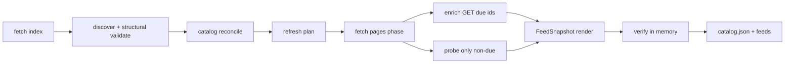

# Developer docs

Maintainer reference for **paul-graham-essay-feeds**.

| Doc | Role |
| :--- | :--- |
| [README.md](./README.md) | Users — hosted subscribe (simple first) + local CLI |
| [DOCS.md](./DOCS.md) | Developers (this file — architecture, CLI, CI, decisions) |
| [CONTRIBUTING.md](./CONTRIBUTING.md) | Contributors (points at this file) |
| [SECURITY.md](./SECURITY.md) | Vulnerability reports |
| [NOTICE](./NOTICE) | Software MIT; essay text remains Paul Graham's |
| [AGENTS.md](./AGENTS.md) | Coding agents |
| [notebook.ipynb](./notebook.ipynb) | Maintainer / custom generation — Run all → `feeds.zip` |

> [!NOTE]
> There is **no** separate `docs/` directory. Architecture decisions are in
> [§ Architecture decisions](#architecture-decisions-normative) below.

> [!TIP]
> End users: subscribe from **[README.md](./README.md)** (hosted raw GitHub
> feeds; no Python). This file is for architecture, CLI contracts, and CI.
> Colab is maintainer / custom generation, not the subscribe path.

---

## Tech stack

Full major tooling used by this repo (verified against `pyproject.toml`,
workflows, `justfile`, and `AGENTS.md`).

### Language & packaging

| Tool | Role | Links |
| :--- | :--- | :--- |
| [Python 3.12+](https://www.python.org/downloads/) | Runtime (`requires-python >=3.12`; CI matrix 3.12–3.14) | [python.org](https://www.python.org/) |
| [uv](https://github.com/astral-sh/uv) | Package manager / runner (`uv sync`, `uv run`, `uvx`) | [docs.astral.sh/uv](https://docs.astral.sh/uv/) |
| [hatchling](https://github.com/pypa/hatch) | Build backend (`[build-system]`) | [hatch.pypa.io](https://hatch.pypa.io/) |

### Runtime dependencies

| Package | Role | Links |
| :--- | :--- | :--- |
| [typer](https://github.com/fastapi/typer) | CLI (`pg-essay-feeds`) | [typer.tiangolo.com](https://typer.tiangolo.com/) |
| [httpx](https://github.com/encode/httpx) | HTTP client (index, enrich, link probes) | [www.python-httpx.org](https://www.python-httpx.org/) |
| [pydantic](https://github.com/pydantic/pydantic) | `Essay` models + validation | [docs.pydantic.dev](https://docs.pydantic.dev/) |
| [pydantic-settings](https://github.com/pydantic/pydantic-settings) | `PG_ESSAY_FEEDS_*` settings | [docs.pydantic.dev/latest/concepts/pydantic_settings](https://docs.pydantic.dev/latest/concepts/pydantic_settings/) |
| [tenacity](https://github.com/jd/tenacity) | Retries around fetches | [tenacity.readthedocs.io](https://tenacity.readthedocs.io/) |
| [tqdm](https://github.com/tqdm/tqdm) | Progress bars (enrich / render / stage) | [tqdm.github.io](https://tqdm.github.io/) |
| [loguru](https://github.com/Delgan/loguru) | Structured logging | [loguru.readthedocs.io](https://loguru.readthedocs.io/) |
| [rich](https://github.com/Textualize/rich) | CLI console + log handler | [rich.readthedocs.io](https://rich.readthedocs.io/) |

### Dev / CI

| Tool | Role | Links |
| :--- | :--- | :--- |
| [pytest](https://github.com/pytest-dev/pytest) | Test runner | [docs.pytest.org](https://docs.pytest.org/) |
| [pytest-cov](https://github.com/pytest-dev/pytest-cov) | Coverage (≥90% fail-under) | [pytest-cov.readthedocs.io](https://pytest-cov.readthedocs.io/) |
| [respx](https://github.com/lundberg/respx) | httpx mock transport | [lundberg.github.io/respx](https://lundberg.github.io/respx/) |
| [ruff](https://github.com/astral-sh/ruff) | Lint + format | [docs.astral.sh/ruff](https://docs.astral.sh/ruff/) |
| [ty](https://github.com/astral-sh/ty) | Type checker | [docs.astral.sh/ty](https://docs.astral.sh/ty/) |
| [just](https://github.com/casey/just) | Task runner (`justfile`) | [just.systems](https://just.systems/) |
| [GitHub Actions](https://github.com/features/actions) | CI + scheduled feed refresh | [docs.github.com/actions](https://docs.github.com/en/actions) |

### Feed standards

| Format | Enriched | Simple | Spec |
| :--- | :--- | :--- | :--- |
| RSS 2.0 | `feeds/rss.xml` | `feeds/rss.simple.xml` | [RSS 2.0 specification](https://www.rssboard.org/rss-specification) |
| Atom 1.0 | `feeds/atom.xml` | `feeds/atom.simple.xml` | [RFC 4287](https://datatracker.ietf.org/doc/html/rfc4287) |
| JSON Feed 1.1 | `feeds/feed.json` | `feeds/feed.simple.json` | [jsonfeed.org/version/1.1](https://www.jsonfeed.org/version/1.1/) |

Source index (context only): [paulgraham.com/articles.html](https://paulgraham.com/articles.html).

---

## Overview

CLI that **live-fetches** the official essays index, extracts items (with
structural validation), optionally enriches short summaries from each essay
page, live-checks reachability (enrich GET and/or dedicated probes), and writes
six flat RSS / Atom / JSON Feed projections under `feeds/` (enriched + simple)
plus durable `catalog.json` at the repo root (current-index mirror only).



| Stage | When | Notes |
| :--- | :--- | :--- |
| Structural validate | Always (inside discover) | Host / URL / count floor |
| Catalog reconcile | Always (default pipeline) | Durable `catalog.json` SSOT (repo root) |
| Refresh plan | Always | F-001: never skip solely on index hash |
| Fetch pages | Default validate on; `--no-validate-links` skips dedicated probes | Dedicated probes are an independent planned phase and still run on ordinary no-op/skip-network (PGF-2026-005). Enrich GET = check + summary for due IDs; dedicated probes only for URLs not enriched this run. Report-only; never drop essays |
| Enrich | Default on; planned pages only | Prior-good summary retained; page GET is the reachability check for those URLs |
| Publish | Verify both snapshots → write six `feeds/*` → `catalog.json` | Public product is root `catalog.json` plus six flat `feeds/*` files. Private gitignored `.cache/generations` + `.cache/materialize.json` + writer lock are implementation-only. No public generation tree / `current.json` |

> [!TIP]
> CI and offline smoke use `--no-enrich --no-validate-links`. Reachability
> checks default on; failures are reported without failing the update.

---

## Architecture

### End-to-end pipeline

```text
raw fetch → decode → discover → catalog reconcile → refresh plan
  → fetch pages (enrich GET = check+summary; probe only non-enrich URLs)
  → FeedSnapshot (enriched + simple) → RSS/Atom/JSON ×2
  → deep verify both → project feeds/ (6 files) + durable catalog
```

```text
catalog.json              # durable SSOT (repo root) — mirrors current index
feeds/rss.xml|atom.xml|feed.json                 # enriched
feeds/rss.simple.xml|atom.simple.xml|feed.simple.json  # simple (title/link)
# no site/* · no state/generations/ · no current.json · no feeds/validated/
```

### Package layout (`src/paul_graham_essay_feeds/`)

| Module | Responsibility |
| :--- | :--- |
| `models.py` | Schema SSOT: Catalog/DiscoveryItem/Essay/FeedSnapshot, ExitCode, ProgressReporter, URL/time helpers |
| `settings.py` | `Settings` (`PG_ESSAY_FEEDS_*`) |
| `http.py` | hop-safe HTTP, evidence, decode, retry, index fetch |
| `discover.py` | index HTML (**selectolax**) → ordered `DiscoveryItem`s; marker/fail-closed F-017 |
| `enrich.py` | page scrape (**selectolax**) → short summary + `published_hint`; link probes |
| `catalog.py` | atomic root `catalog.json` I/O + reconcile + refresh + bootstrap-from-feeds |
| `feeds.py` | snapshot-native RSS/Atom/JSON render + write |
| `verify.py` | deep in-memory cross-format verification |
| `pipeline.py` | orchestrate + verify-then-publish root catalog + feeds |
| `publication.py` | writer lock, staged `.cache/generations`, materialize/recover |
| `cli.py` | Typer: `update` / `check` only |

Entry points: `cli:main` / `__main__.py`. Schema SSOT is Pydantic `models.py` (no parallel JSON Schema tree).

### Artifacts

| Path | Role |
| :--- | :--- |
| `catalog.json` | Durable catalog SSOT (repo root) — current index only |
| `feeds/` | Six flat projections: enriched + simple (see AD-002) |
| `.cache/` | Gitignored HTTP validator sidecar |
| `notebook.ipynb` | Maintainer / custom generation (HTML intro + generate → `feeds.zip`) |

### State publication

| Path | Git |
| :--- | :--- |
| `catalog.json` | **Commit** — durable SSOT (repo root; index mirror) |
| `feeds/*` | **Commit** — six flat feed projections (enriched + simple) |
| `.cache/` | **Do not commit** — HTTP sidecar, writer lock, private `.cache/generations/<id>/`, `.cache/materialize.json` |

Publish order (AD-005): verify both snapshots in memory → write six `feeds/*` →
write `catalog.json`. Catalog is SSOT; feeds are projections. The planner **skip**
path still takes the writer lock, recovers, and verifies the existing seven-file
bundle before `unchanged`. The **public** product is only those seven files.
Private gitignored `.cache/generations`, `.cache/materialize.json`, and the
writer lock are authorized recovery staging — not a second public feed tree.
Forbidden: public `state/generations`, `current.json`, `site/`, or
`feeds/validated/`.

---

## CLI reference

```bash
pg-essay-feeds update    [OPTIONS]
pg-essay-feeds check     [OPTIONS]
```

### Precedence

```text
COMMANDLINE > pydantic-settings env / .env > field defaults
```

Flags override Settings **only when explicitly passed**. Two patterns (not every
flag uses `_is_cmdline`):

| Pattern | Flags | Mechanism |
| :--- | :--- | :--- |
| **None-sentinel dual bools** | `--enrich/--no-enrich`, `--validate-links/--no-validate-links`, `--force/--no-force`, `--all-pages/--no-all-pages` | Typer `bool \| None = None`; omitted → keep Settings/env |
| **Cmdline-gated defaults** | `-q` / `--quiet`, `-v` / `--verbose` | Typer `bool = False`; `_cmdline_or_none` applies only when `ParameterSource.COMMANDLINE` |

Optional scalars (`--repo-root`, `--min-items`, `--timeout`, …) use `T | None = None`
the same way as dual bools. If both quiet and verbose end up true, quiet wins.

> [!NOTE]
> Env-only knobs (no CLI flags): `STALE_AFTER_DAYS`, `LINK_WORKERS`,
> `ENRICH_WORKERS`, `MAX_BYTES`, `ALLOW_DISCOVERY_FALLBACK`,
> `HOST_COOLDOWN_SECONDS`, `MAX_PAGE_FETCHES`, `MAX_LINK_VALIDATIONS`
> (all under `PG_ESSAY_FEEDS_*`). `--all-pages` / `PG_ESSAY_FEEDS_ALL_PAGES`
> uncaps both fetch budgets. See [§ Configuration](#configuration).

### `update`

| Flag | Default | Meaning |
| :--- | :--- | :--- |
| `--repo-root PATH` | cwd / env | Output root for `feeds/` + `catalog.json` |
| `--source-file PATH` | — | Local HTML instead of network fetch |
| `--min-items INT` | `Settings.min_items` (`MIN_ITEMS`) | Fail if fewer items |
| `--timeout FLOAT` | `30` | HTTP timeout (seconds) |
| `--retries INT` | `3` | Extra attempts after first |
| `--enrich` / `--no-enrich` | enrich on (env) | Per-page short summary scrape |
| `--force` / `--no-force` | off (env) | Bypass refresh-planner no-op (marks work due; not an index-hash skip) |
| `--validate-links` / `--no-validate-links` | on (env) | Live probes even on no-op/skip-network; report-only; never drop essays |
| `--public-base-url URL` | env / unset | Public base for self links |
| `--all-pages` / `--no-all-pages` | off (env) | Uncap page fetches and dedicated link probes (full due corpus). Default caps are 40 / 40 (matching CI). |
| `--from-feeds` | off | Seed the in-memory catalog candidate from existing feeds; persist only after successful verification/publication |
| `--abandon-recovery` / `--no-abandon-recovery` | off | Explicit repair for irrecoverable `.cache/materialize.json` (quarantines pointer + generation). Not a third command. |
| `--result-file PATH` | — | Append `links_checked`, `links_skipped`, then `action=unchanged\|state_changed\|updated`; also writes `$GITHUB_OUTPUT` when set (quiet success side-channel) |
| `-q` / `--quiet` | off (env) | Quiet success → zero stdout **and** stderr; errors only; result-file / `$GITHUB_OUTPUT` still write |
| `-v` / `--verbose` | off (env) | Debug logs |

### `check`

Deep-verifies both enriched and simple `feeds/` sets (item-count parity across
RSS/Atom/JSON; enriched JSON `content_text` == `summary` with length in
`[1, FEED_SUMMARY_CHARS]`). Root `catalog.json` is **required** (M-25): `check`
loads it and asserts `entry_order` ids match ordered ids in both `feed.json` and
`feed.simple.json`. No `site/` requirement.

| Flag | Default | Meaning |
| :--- | :--- | :--- |
| `--repo-root PATH` | cwd / env | Root containing `feeds/` |
| `--min-items INT` | `Settings.min_items` (`MIN_ITEMS`) | Floor for item count |
| `-q` / `--quiet` | off (env) | Quiet success → zero stdout **and** stderr; errors only |
| `-v` / `--verbose` | off (env) | Debug logs |

---

## Configuration

`Settings` loads env vars with prefix **`PG_ESSAY_FEEDS_`** (optional `.env`).

Env-only (no CLI flag): `MAX_BYTES`, `LINK_WORKERS`, `ENRICH_WORKERS`, `STALE_AFTER_DAYS`, `ALLOW_DISCOVERY_FALLBACK`, `HOST_COOLDOWN_SECONDS`, `MAX_PAGE_FETCHES`, `MAX_LINK_VALIDATIONS` (plus `LINK_TIMEOUT` / `ENRICH_TIMEOUT`). `--all-pages` uncaps both fetch budgets.

| Env var | Default | Notes |
| :--- | :--- | :--- |
| `PG_ESSAY_FEEDS_SOURCE_URL` | official articles.html | Index URL |
| `PG_ESSAY_FEEDS_REPO_ROOT` | cwd | Resolved absolute path |
| `PG_ESSAY_FEEDS_MIN_ITEMS` | `MIN_ITEMS` (`models.py`) | Safety floor (not live catalog size) |
| `PG_ESSAY_FEEDS_TIMEOUT` | `30` | Index fetch timeout |
| `PG_ESSAY_FEEDS_RETRIES` | `3` | Tenacity attempts = retries+1 |
| `PG_ESSAY_FEEDS_MAX_BYTES` | 5 MiB | Response size cap (env-only) |
| `PG_ESSAY_FEEDS_VALIDATE_LINKS` | `true` | Live probes (report-only; `--no-validate-links` to skip) |
| `PG_ESSAY_FEEDS_LINK_TIMEOUT` | `10` | Per-probe timeout |
| `PG_ESSAY_FEEDS_LINK_WORKERS` | `4` | Live-probe thread pool (not enrich; env-only) |
| `PG_ESSAY_FEEDS_ENRICH` | `true` | Per-page short summary scrape |
| `PG_ESSAY_FEEDS_ENRICH_WORKERS` | `4` | Enrich thread pool (env-only) |
| `PG_ESSAY_FEEDS_ENRICH_TIMEOUT` | `15` | Per-page timeout |
| `PG_ESSAY_FEEDS_FORCE` | `false` | Bypass refresh-planner no-op (not an index-hash skip) |
| `PG_ESSAY_FEEDS_PUBLIC_BASE_URL` | unset | Public base for feed self links (https directory URL; no query, fragment, or userinfo) |
| `PG_ESSAY_FEEDS_STALE_AFTER_DAYS` | `30` | Re-fetch page metadata after N days (env-only; update-feeds.yml sets `90`) |
| `PG_ESSAY_FEEDS_MAX_PAGE_FETCHES` | `40` | Cap due page enrich GETs per run (`none`/`unlimited` = uncapped; empty keeps 40) |
| `PG_ESSAY_FEEDS_MAX_LINK_VALIDATIONS` | `40` | Cap dedicated link probes per run (`none`/`unlimited` = uncapped; empty keeps 40) |
| `PG_ESSAY_FEEDS_ALL_PAGES` | `false` | Uncap both fetch budgets (same as `--all-pages`) |
| `PG_ESSAY_FEEDS_ALLOW_DISCOVERY_FALLBACK` | `true` | Sparse-marker discovery fallback (env-only) |
| `PG_ESSAY_FEEDS_HOST_COOLDOWN_SECONDS` | `0.05` | Min seconds between requests to the same host (shared `HostCooldown`; env-only) |
| `PG_ESSAY_FEEDS_QUIET` / `PG_ESSAY_FEEDS_VERBOSE` | false | Log levels |

```bash
export PG_ESSAY_FEEDS_MIN_ITEMS=10   # optional: lower extract/check floor
export PG_ESSAY_FEEDS_ENRICH=false   # optional: skip per-page scrapes
```

### Latency & cost

| Mode | Network | Notes |
| :--- | :--- | :--- |
| Default (`ENRICH=true`, checks on) | Index + up to 40 due page GETs; dedicated probes capped at 40 for URLs not enriched this run | Conservative bound matching CI; `--all-pages` for the full due corpus |
| `--no-enrich` / `PG_ESSAY_FEEDS_ENRICH=false` | Index (+ probes unless disabled, still capped at 40) | Fast; generic blurbs when no summary |
| `--all-pages` / `PG_ESSAY_FEEDS_ALL_PAGES=true` | Uncapped due page GETs and dedicated probes | Explicit full-corpus opt-in |
| Not due (catalog planner) | Index GET (or local read) only | No page fetches planned → skip rewrite, but still take the writer lock, recover, and verify the existing seven-file bundle |
| `--force` / `PG_ESSAY_FEEDS_FORCE=true` | Planner marks work due; per-run caps still apply unless `--all-pages` | Bypass refresh-planner no-op (not index-hash skip) |
| `--no-validate-links` | Skip dedicated HEAD/GET probes | Default checks are report-only and never drop essays |

CI and offline smoke use `--no-enrich --no-validate-links`. Reachability
checks default on; failures are logged without failing the update.

### Change detection (catalog planner — F-001)

- **SSOT:** `catalog.json` mirrors the current index + per-page resource state + prior-good summaries.
- **Refresh plan:** marks `STALE` / `MISSING_METADATA` / `FORCE` / `CANARY` independently of
  index identity. Index-only hash equality is **not** a valid skip reason when page work is due.
- **Publication:** verify both snapshots → project six `feeds/*` → durable
  `catalog.json` (catalog SSOT; feeds are projections).

> [!NOTE]
> There is **no** `data/essays.json`. Operational state lives in the durable catalog,
> not as feed-body SSOT.

---

## Feeds contract

### Item fields (all formats)

| Field | Required | Source |
| :--- | :--- | :--- |
| title | yes | index |
| link / url | yes | https, allowlisted host |
| guid / id | yes | URL or Turbify path UUID |
| description / summary | yes | `feed_summary()` (enrich or generic blurb, ≤~400 chars) |
| JSON `content_text` | yes | same short `feed_summary()` (not full essay body) |
| `published_hint` | no | enrich metadata only (not emitted in feeds); month+year string |
| pubDate / published / date_published | no | only when `published_at` is set (real full calendar day) |

### Dates

- Month+year on the page → **`published_hint` only** (enrich metadata; not a feed field).
- Enrich **never** invents a day-1 `published_at` from month+year.
- Feed dates (`pubDate` / Atom `<published>` / JSON `date_published`) emit **only** when
  `published_at` is set. Enrich leaves `published_at` unset today (no full-day source).
- Month+year does **not** become a feed date.

### Atom / feed-level timestamps (catalog pipeline)

| Element | Value |
| :--- | :--- |
| Feed `<updated>` / RSS `lastBuildDate` | generation `logical_updated_at` (max item observation), not wall-clock |
| Entry `<updated>` | `observed_updated_at` (truthful; never 1970 sentinel) |
| Entry `<published>` / RSS `pubDate` / JSON `date_published` | only when exact `published_at` is set |

> [!WARNING]
> Month+year never invents a day-1 `published_at`. Bootstrap observation uses the
> labeled migration clock, not epoch sentinels.

### Writes & verify

1. Verify enriched and simple RSS/Atom/JSON **in memory** (structure, parity,
   uniqueness, summary bounds).
2. Project six flat `feeds/*` files, then durable `catalog.json`.

CLI `check` validates both `feeds/` projections (count parity, enriched
`content_text` bounds) and requires `catalog.json`, asserting `entry_order` id
parity with both JSON feeds. Deep verify runs before write.

### Feed identity (Atom)

The Atom feed `<id>` is selected from `FeedSnapshot.variant`:
`FEED_ID` for enriched (`tag:wyattowalsh.github.io,2026:paul-graham-essay-feeds`)
and `FEED_ID_SIMPLE` for the simple triple (`…:simple`). Those tag strings are
**permanent feed identities** for readers, not a claim that a site is hosted on
github.io. Do not change them casually — swapping Atom ids breaks reader state.

### Non-goals

| Non-goal | Rationale |
| :--- | :--- |
| Full essay bodies | Metadata-only feeds |
| OPML | Out of scope |
| Invented feed dates from month+year | No day-1 fiction |
| `data/essays.json` | Durable state is `catalog.json` |
| Feed-embedded operational SSOT | Catalog is SSOT; feeds are projections |

> [!NOTE]
> JSON Feed items **do** include short `content_text` (= `summary`). That is
> metadata-only, not the full essay. Optional `public_base_url` enables self/feed
> absolute URLs.

### HTTP safety

Shared `hop_safe_request` (and `hop_safe_get` wrapper): `follow_redirects=False`,
every hop host must be in the caller allowlist. `allow_loopback` is **start-bound**:
defaulted once from the start URL host, then fixed for every hop including the final
URL. Redirect responses are **closed without reading the body**. When `max_bytes` is
set, the final response is streamed with `Content-Length` reject (when present) plus a
streaming hard-stop and a final length check. Live HEAD probes pass the same
`max_bytes` budget. Clients use `trust_env=False`. Local `--source-file` uses the same
byte cap.

| Traffic | `allowed_hosts` |
| :--- | :--- |
| Index fetch | `{paulgraham.com}` |
| Enrich + live probes | `ALLOWED_HOSTS` (`paulgraham.com`, `sep.turbifycdn.com`) |

Turbify query strings are stripped for stable identity.

> [!NOTE]
> **PGF-2026-015 (accepted-risk):** GitHub raw serves committed `feeds/*` as
> `text/plain` (the body is still RSS / Atom / JSON). This project does not add
> GitHub Pages or `site/`. Strict readers that require `application/rss+xml`
> should point at local `feeds/` from the CLI. Typed CDN hosting is out of
> scope.

---

## Testing

| Layer | Path | Network |
| :--- | :--- | :--- |
| unit | `tests/unit/test_<module>.py` (mirrors package modules) | no |
| integration | `tests/integration/` | local HTTP only |
| e2e | `tests/test_cli_e2e.py` | no (CLI + fixtures) |
| smoke | `tests/smoke/` | no |
| live | `tests/test_live_fetch.py` | **yes** (opt-in) |

```bash
just test          # default: not live, cov ≥ 90%
just test-unit
just test-integration
just test-e2e
just test-smoke
just test-live     # hits paulgraham.com
just cov
```

`notebook.ipynb` is excluded from ruff (`extend-exclude`).

> [!IMPORTANT]
> Unit tests are a **flat mirror** of package modules:
> `tests/unit/test_<module>.py` ↔ `src/paul_graham_essay_feeds/<module>.py`.
> No nested `tests/unit/paul_graham_essay_feeds/` unless the package gains
> subpackages.

---

## CI & local quality gates

### GitHub Actions

| Workflow | Role |
| :--- | :--- |
| `ci.yml` | matrix 3.12–3.14; lint/types (3.13); pytest + cov ≥90% (report precision 2) then raw `coverage.xml` lines+branches `covered/valid ≥ 0.90`; committed-feed `check` on `feeds/`; offline catalog smoke (`--no-enrich --no-validate-links`; `feeds/` + `catalog.json`); assert no `feeds/validated/`; dist job |
| `release.yml` | on tag `v*`: version match, quality gates, `uv build --no-sources`, wheel smoke, GitHub Release. Privileged `setup-uv` does not force `enable-cache: true` |
| `update-feeds.yml` | scheduled live refresh → upload seven-file workspace → publish gates the **downloaded** candidate (not a sibling source checkout) → commit `feeds/` + `catalog.json` to `main` → `product_sha=$(git rev-parse HEAD)` → re-check that tree → attest seven subjects plus provenance context (source SHA, candidate digest, subjects, product SHA). Bot push still `--force-with-lease`. Publish `setup-uv` sets `enable-cache: false` |
| `verify-product.yml` | `workflow_run` after “Update feeds” (or `workflow_dispatch` with an explicit SHA): check + audit slice on the **product SHA** from the `product-identity` artifact or the explicit ref — never mutable `main` HEAD. `GITHUB_TOKEN` push does not retrigger `ci.yml`. `setup-uv` does not force cache |
| Dependabot | weekly `uv` + `github-actions` |

CI policy: exit 0 on matrix; full-SHA action pins; least privilege on generation jobs;
multi-line scripts use `set -euo pipefail`. Coverage fail-under is enforced on full
suite entrypoints (CI / `just test` / `just ci-local`), not on partial path selection.
`[tool.coverage.report] precision = 2` and `fail_under = 90` so 89.955% cannot round
to 90.0; CI additionally fails if the raw Cobertura totals are below 0.90.

> [!NOTE]
> GitHub Actions auto-sets `$GITHUB_OUTPUT` for step outputs. `update --quiet` still
> appends `links_checked`, `links_skipped`, and `action=unchanged|state_changed|updated`
> there (and to `--result-file` when passed). The scheduled workflow publishes when
> `action` is `updated`
> **or** `state_changed` so catalog-only clock advances are not dropped.
> Settings default `STALE_AFTER_DAYS=30`; `update-feeds.yml` overrides to `90` so
> daily runs do not mass re-enrich on day 31 when the index is unchanged.

### Pipeline action contract

| `action` value | Meaning | Tracked durable writes | Workflow publish? |
| :--- | :--- | :--- | :--- |
| `unchanged` | No material or catalog state write | none | no |
| `state_changed` | Catalog state/clocks written; all six feed bytes identical | `catalog.json` | **yes** |
| `updated` | Material feed projections rewritten (and catalog) | `catalog.json` + `feeds/*` | **yes** |

`PipelineResult.changed_paths` lists relative paths written for machine consumers.
`links_checked` / `links_skipped` count dedicated live probes this run (enrich GET
covers due pages; those IDs are not skipped-probe counts).

### just recipes

| Recipe | Action |
| :--- | :--- |
| `sync` | `uv sync --all-groups` (day-to-day, unlocked) |
| `sync-locked` | `uv sync --locked --all-groups` (gates / `ci-local`) |
| `lint` | ruff format check + ruff check |
| `type` | `ty check` |
| `test` | pytest + **cov ≥ 90%** |
| `ci-local` | locked sync + lint + type + test + quiet check + build |
| `check` | `pg-essay-feeds check` |
| `update` | live `pg-essay-feeds update` |
| `build` | `uv build --no-sources` + wheel smoke |
| `all` | lint + type + test + check |

Quality order: **format → lint → types → tests → check**.

```bash
uv sync --locked --all-groups
uv run ruff format --check .
uv run ruff check .
uv run ty check
uv run pytest --cov-fail-under=90
uv run pg-essay-feeds check --quiet
uv build --no-sources
```

---

## Notebook (maintainer / custom generation)

[`notebook.ipynb`](./notebook.ipynb) is **not** the subscribe path. Readers
use the hosted raw GitHub feeds in README. Colab is for generating a private
`feeds.zip`.

1. HTML hero (`IPython.display.HTML`, `#@title` + `cellView: form` so code stays
   hidden) — brand, unofficial disclaimer, how-to, RSS / Atom / JSON what-you-get
   (enriched + `*.simple.*` under `feeds/`), metadata-only honesty; notes
   `catalog.json` on disk and zip packaging
2. Form cell (`#@title` + `cellView: form`): **Enrich**, **Auto-download**;
   `ROOT` under Advanced (default `/content/pg-feeds`)
3. `!pip install -q "uv>=0.12"` → `subprocess` `uvx … update` (capture + print
   logs; `+ --no-enrich` when off; **do not** pass `--no-validate-links` —
   package default `validate_links=True`; fetch-pages phase: enrich GET =
   check + summary for due IDs, dedicated probes only for non-enriched URLs) →
   `uvx … check` → assert six `feeds/{rss,atom,feed}{,.simple}.*` → zip all six →
   optional Colab download when `AUTO_DOWNLOAD`
4. Status HTML after the zip (report-only): **green** only when every attempted
   probe and enrichment GET succeeded; **amber** when `PGF_REACHABILITY_FAIL`
   or `PGF_ENRICH_DEGRADED` tokens appear (legacy `Link probe issue:` still
   counts as reachability). Parse-after-HTTP is metadata degradation, not an
   unreachable URL. Zip still downloads.
5. Troubleshooting cell (`#@title` + form-hidden HTML `<details>`)

No package API imports in the kernel; CLI only via `uvx` from
`git+https://github.com/wyattowalsh/paul-graham-essay-feeds@main`.
Intended release is **1.0.0**; until the `v1.0.0` tag exists, install from
`main`. After the tag is published, flip that one sentence to `@v1.0.0`.
Do not pin a tag that does not exist.
`notebook.ipynb` stays ruff/ty-excluded.

---

## Release / maintenance

1. `just all` green on a clean tree
2. Optional: refresh committed `feeds/` (see below)
3. `pg-essay-feeds check` (parity + `content_text`)
4. Commit when ready (user-gated) — ship **check + regenerated feeds together**
5. Push an annotated tag `vX.Y.Z` matching `__version__` (e.g. `1.0.0` →
   `v1.0.0`) → `.github/workflows/release.yml` asserts the tag↔version match,
   runs the same quality gates as CI, then builds wheel/sdist, creates a
   GitHub Release via softprops with **auto-generated release notes** (from
   commits/PRs since the previous tag), and attaches `dist/*`. No `uv publish`
   on tag. **Do not cut the tag from this change.** Intended release is
   **1.0.0**; until the `v1.0.0` tag exists, install from `main`. After the
   tag exists, flip that one maintained sentence in README + notebook to
   `@v1.0.0`. Do not pin a tag that does not exist.

```bash
just build   # local: uv build --no-sources + wheel smoke
```

> [!NOTE]
> Hatch sdist excludes `/feeds`, `/.github`, `/.venv`, and `/dist`. That does
> **not** break `uvx --from git+…@main` (or `@v1.0.0` after the tag exists):
> git install still clones the full repo (committed feeds available locally);
> installed wheels write `feeds/` at runtime. Until `v1.0.0` exists, user
> docs install from `@main`.

### Regenerating committed feeds

```bash
uv run pg-essay-feeds update --force
uv run pg-essay-feeds check --quiet
```

Expectations after regen:

- Every JSON item has short `content_text` (== `summary`).
- `date_published` / RSS `pubDate` / Atom `<published>` are **absent** unless a real
  full-day `published_at` exists (enrich sets month+year `published_hint` only).
- Atom entry `<updated>` is truthful `observed_updated_at` (no 1970 sentinel).
- Durable catalog under `catalog.json` (current index only; no lifecycle keys).
- Six flat projections under `feeds/`:
  `rss.xml` / `atom.xml` / `feed.json` (enriched) and
  `rss.simple.xml` / `atom.simple.xml` / `feed.simple.json` (simple).
  No `feeds/validated/` or other subdirectory trees.
- Tag `v{version}` must match package `__version__` for release.

> [!WARNING]
> Be polite to paulgraham.com: defaults use `ENRICH_WORKERS=4` /
> `LINK_WORKERS=4`; avoid hammering live probes unless diagnosing.

CI runs `pg-essay-feeds check` on the committed `feeds/` tree. Do not land code that
requires `content_text` without matching regenerated artifacts in the same change.

### Version pin (PGF-2026-004)

Package `__version__` is `1.0.0`. Historical `[0.2.0]` in CHANGELOG is the
prior advertised-but-untagged integrity work — do not revive `@v0.2.0` as a
user pin. Intended release is **1.0.0**; until the `v1.0.0` tag exists,
install from `main`. After the tag is published, flip that one sentence.

### Branch protection (rulesets)

Path-aware ruleset **intent** (PGF-2026-016, maintainer-apply — this change
does **not** execute `gh api`; agents must not apply rulesets):

| Surface | Policy |
| :--- | :--- |
| Source on `main` | Require a pull request + CI checks |
| Product files | **Bot path bypass:** exclude `feeds/**/*` and `catalog.json` so `github-actions[bot]` from the **Update feeds** workflow can push **only** those seven files |
| Bypass | Do **not** add the GitHub Actions app as a global `bypass_actors` Integration (that would let any workflow skip PRs on source) |

`update-feeds.yml` already stages only those seven product paths. Publish copies
the downloaded candidate workspace onto the product paths, checks it, then
force-with-lease pushes. After the push it records `product_sha=$(git rev-parse
HEAD)`, re-checks that tree, and attests the seven files plus a provenance
document naming source SHA, candidate digest, subjects, and product SHA. A
`GITHUB_TOKEN` push does **not** retrigger `on: push` CI. `verify-product.yml`
(`workflow_run` after “Update feeds”, or `workflow_dispatch` with an explicit
SHA) checks out that product SHA from the `product-identity` artifact — not
mutable `main` HEAD. Signing is the Actions artifact attestation, not a repo
GPG key. Ruleset apply is still a maintainer action (partial until applied).

If REST rejects `conditions.file_path`, set the same exclude in the UI
(Settings → Rules → Rulesets → targeting / target files) using `fnmatch`
(`feeds/**/*`, `catalog.json`).

List existing rulesets (read-only):

```bash
gh api repos/wyattowalsh/paul-graham-essay-feeds/rulesets
```

Create (first time) or replace `RULESET_ID` via PUT:

```bash
# Create — do not run from an agent session unless a maintainer asks.
gh api --method POST repos/wyattowalsh/paul-graham-essay-feeds/rulesets \
  --input - <<'EOF'
{
  "name": "protect-main-source",
  "target": "branch",
  "enforcement": "active",
  "bypass_actors": [],
  "conditions": {
    "ref_name": {
      "include": ["refs/heads/main"],
      "exclude": []
    },
    "file_path": {
      "include": ["**/*"],
      "exclude": ["feeds/**/*", "catalog.json"]
    }
  },
  "rules": [
    {
      "type": "pull_request",
      "parameters": {
        "required_approving_review_count": 0,
        "dismiss_stale_reviews_on_push": true,
        "require_code_owner_review": false,
        "require_last_push_approval": false,
        "required_review_thread_resolution": false
      }
    },
    {
      "type": "required_status_checks",
      "parameters": {
        "strict_required_status_checks_policy": true,
        "do_not_enforce_on_create": false,
        "required_status_checks": [
          {"context": "quality (3.12)"},
          {"context": "quality (3.13)"},
          {"context": "quality (3.14)"}
        ]
      }
    }
  ]
}
EOF

# Update an existing ruleset (replace RULESET_ID from the list call).
gh api --method PUT \
  repos/wyattowalsh/paul-graham-essay-feeds/rulesets/RULESET_ID \
  --input - <<'EOF'
{ ...same body as POST... }
EOF
```

> [!WARNING]
> Do not grant `bypass_actors` `actor_type: Integration` / GitHub Actions
> (`actor_id` `15368`) on this ruleset. Path-exclude product files instead so
> Update feeds can push `feeds/` + `catalog.json` without a source bypass.

---

## Troubleshooting

| Symptom | Likely cause | Fix |
| :--- | :--- | :--- |
| `Only N essays (need ≥ min_items)` | index HTML incomplete / markers changed | Inspect source; temporary `--min-items` only after review |
| Enrich warnings / thin descriptions | page fetch failed or sparse HTML | Retry; or `--no-enrich` for index-only |
| Env enrich/validate ignored | flag always passed historically | Pass flags only when overriding; check `PG_ESSAY_FEEDS_*` |
| Turbify-looking double URL | relative join bug | Should be impossible post-canonicalize; open an issue with HTML snippet |
| Missing / empty durable catalog | seed in-memory catalog candidate from existing feeds | `update --from-feeds` once (persists only after successful verification/publication), then normal `update` |
| Empty action / `UNCHANGED` | refresh planner not due (no durable write) | Expected; use `--force` / `FORCE=true` to bypass planner no-op |
| `STATE` / `state_changed` | catalog clocks/state written; feeds byte-identical | Expected after enrich 304/material-noop; workflow still publishes catalog |
| Want mass re-enrich | planner skipped pages (not stale) | `update --force` (bypasses planner no-op; not an index-hash myth) |
| Quiet run but saw output | logging/side-channel, not console success | Errors still print; `--result-file` / `$GITHUB_OUTPUT` write under `-q` |
| `check` missing files | never ran `update` in that root | `update --repo-root …` first |
| `check` count / `content_text` / id parity fail | tear window or partial copy | Re-run `update`; ensure all six feeds ship with `catalog.json` |
| Irrecoverable `.cache/materialize.json` | recover fail-closed after quarantine | `update --abandon-recovery` then retry; not a third command |
| Colab zip missing | generate cell not run / update failed | Re-run generate (or Run all); confirm `feeds/` under Advanced `ROOT` |
| Ruff wants to touch notebook | excluded by design | `extend-exclude = ["notebook.ipynb"]` |

---

## Architecture decisions (normative)

All architecture decisions live **in this file** (no separate `docs/` tree). Numbered
for cross-reference from code comments only.

### AD-001 — Feed contract

Emit metadata-only **RSS 2.0**, **Atom 1.0**, and **JSON Feed 1.1** from one immutable
`FeedSnapshot`.

| Field | Source | RSS | Atom | JSON Feed |
| :--- | :--- | :--- | :--- | :--- |
| Stable id | catalog identity | `guid` | `id` | `id` |
| URL | allowlisted HTTPS | `link` | `link rel=alternate` | `url` |
| Title | index/page | `title` | `title` | `title` |
| Summary | short source text | `description` | `summary` | `summary` + `content_text` |
| Published | exact `published_at` only | `pubDate` if set | `published` if set | `date_published` if set |
| Updated | `observed_updated_at` | — | `updated` (required, truthful) | `date_modified` if set |

Feed-level `lastBuildDate` / Atom feed `updated` = generation `logical_updated_at`.
Self/feed URLs only when `public_base_url` is set. That value is a directory
URL (canonical trailing slash): no query, fragment, or userinfo (AUD-006).
Cross-format ordered parity for id/url/title/summary. No full bodies; no
invented dates; no 1970 entry `updated`.

### AD-002 — Catalog SSOT

Schema-versioned **`catalog.json`** is durable SSOT (Pydantic in
`models.py`). Membership aims to mirror the **current** articles index: a
one-run omission of 1-4 essays is **held** (private `consecutive_absences`,
default 0 so existing catalogs load) and is not published as a deletion; a
second consecutive observation **hard-deletes**. Five or more removals at
ratio >15% **quarantine** before reconcile (H-03 / PGF-2026-013). No
lifecycle / soft-retain / tombstone feed states. Prior enrichment is reused
when an id is still on the index. Preserve prior-good summary on recoverable
enrich failures. Index-only skip is **invalid**; refresh planning uses catalog
+ page state (F-001). Dedicated live probes rotate via
`catalog.versions["link_validation_cursor"]` (AUD-010). Fair page-fetch
rotation persists `(last_selected_index + 1) % catalog_size` in
`page_fetch_cursor` (PGF-2026-008), advancing after attempts including
failures via `catalog_with_page_fetch_cursor`; backoff (`next_retry_at`) is
independent. Catalog material digest excludes wire/`raw_sha256` (provenance
only); feed-visible fields plus decoded page hash decide skip vs publish
(PGF-2026-009). On-disk `catalog.json`
is `schema_version: 3` (compact diffs: omit per-entry `position` and shared
`last_seen_at`). Schema 2 files still load via `migrate_catalog`. Published
bundles stamp a non-null `last_generation_id`.

Feed projections (both deep-verified before write):

| Files | Kind |
| :--- | :--- |
| `feeds/rss.xml`, `atom.xml`, `feed.json` | enriched summaries |
| `feeds/rss.simple.xml`, `atom.simple.xml`, `feed.simple.json` | title/link only |

### AD-003 — Time and identity

| Field | Meaning | Public use |
| :--- | :--- | :--- |
| `first_seen_at` / `last_seen_at` | index observation | catalog only |
| `last_checked_at` | latest request attempt (success or failure) | never content time; kept in sync with `last_attempted_at` on schema-v2 writes |
| `last_attempted_at` | explicit lifecycle attempt clock | catalog only |
| `last_response_at` | latest response or transport outcome | catalog only |
| `last_success_at` | accepted 200/304/local-source success; schema-v2 freshness TTL | catalog only; empty-item `logical_updated_at` fallback |
| `observed_updated_at` | material metadata change | Atom entry `updated` |
| `published_at` | exact trustworthy date only | feed published fields |
| `logical_updated_at` | generation material clock | feed-level updated |

Aware UTC only; month-year → `published_hint` only. Stable id = permalink URL (PG) or
UUID URN (protected Turbify ACL chapters). Normalize `www` → apex; strip fragments.

### AD-004 — HTTP policy

- `trust_env=False`; hop-safe host allowlist; HTTPS (loopback HTTP test-only).
- HEAD must **not** treat representation `Content-Length` as body budget (F-016).
- GET hard-caps transferred bytes; shared decoder (BOM → transport charset → meta →
  UTF-8 → Windows-1252 fallback); quarantine unexpected U+FFFD.
- Retry idempotent transients only; honor bounded `Retry-After`; full jitter otherwise.
- Persist ETag/Last-Modified/hashes/byte counts/`selected_encoding` on accepted
  200; 304 preserves prior hashes/counts/encoding while advancing clocks
  (PGF-2026-010). Conditional GET / 304 as check evidence only
  (AUD-016 / PGF-2026-011: 304 is `NOT_MODIFIED` only with conditionals
  **actually sent on the final hop** and prior material. Redirect hops drop
  per-request extras; an unconditional final-hop 304 is never `NOT_MODIFIED`).
- `raw_sha256` / `bytes_received` are **wire** bytes (pre content-decode).
  `decoded_sha256` / `decoded_bytes_received` are the entity after Content-Encoding
  is removed (AUD-007). They match for identity encoding. Declared non-identity
  Content-Encoding tokens fail closed when unsupported — unknown encodings are
  never treated as identity (PGF-2026-017). Supported codings: gzip / x-gzip,
  deflate, br (optional brotli package; missing-brotli error is unchanged).
- Shared `HostCooldown` (default `host_cooldown_seconds=0.05`) spaces enrich GETs
  and dedicated probes to the same host (AUD-017).

### AD-005 — Publication

```text
verify enriched + simple in memory → write six feeds/* → write catalog.json
```

Feeds-then-catalog: projections land before the durable catalog stamp. This is
**not** a multi-file atomic transaction — **local seven-file visibility**
(PGF-2026-018): public replace is one file at a time (six `feeds/*` then
`catalog.json`). A crash can leave a torn seven-file set; `check` is the
detector (`entry_order` id parity vs both JSON feeds). Failure before any
durable replace leaves prior catalog + feeds intact. Do not add a second
public tree or a directory rename-swap. Public product stays flat: no public
generation tree / `current.json`, no `site/`, no `feeds/validated/`.
Private gitignored `.cache/generations` + `.cache/materialize.json` + writer lock
remain the recovery implementation.

Every durable decision (including the planner **skip** / no-op path) runs
**under the writer lock**: `acquire_write_lock` → `recover_materialize` → verify
the existing seven-file bundle (skip path) or stage/publish (AUD-001). Network
stays outside the lock. The lock is POSIX `fcntl.flock` / `WriteLock` on
`.cache/write.lock` (macOS/Linux; not Windows — no Win32 lock). Release
unlocks and closes the fd; the lock-file inode is never unlinked
(PGF-2026-001). Live locks are never stolen by mtime (AUD-002). Staging
allocates `gen_id`, stamps `catalog.last_generation_id`, then writes
artifacts + MANIFEST so manifest, pointer, and public catalog agree
(PGF-2026-003). Recover is fail-closed: malformed or unverifiable pointers
raise after a best-effort quarantine; they are never silently deleted
(AUD-005). `--abandon-recovery` is the explicit repair for that
irrecoverable pointer.

Material-noop after enrich may still persist catalog clocks when feed bytes are
unchanged. The decisive comparison and chosen write happen **after** acquiring
the writer lock and after `recover_materialize`, including when recovery is a
no-op (PGF-P0-001 / RV-R-001). Matching post-lock disk overlays this run's
non-material clocks onto the **reloaded** catalog. If the durable catalog
material digest differs from the digest the candidate was based on, finalize
aborts with `FeedError` rather than publishing a slower older candidate over
a newer accepted state (PGF-2026-002). Same-base new material still publishes
feeds and catalog together in the same lock (RV-C-001). Never
catalog-only-save the pre-lock object. The path returns `action=state_changed`
(not `unchanged`) when only the catalog is written, so scheduled automation
commits the catalog.

### AD-006 — CLI and Python

- Python **3.12–3.14** (`requires-python >=3.12`); ship `py.typed`.
- POSIX only (macOS/Linux classifiers): writer lock is `fcntl.flock`.
- Commands: `update` + `check` only (no `site` / legacy pipeline escape hatches).
  `update --abandon-recovery` is a flag on `update`, not a third command.
- Flags override Settings only when explicitly passed (None-sentinel dual bools
  **or** `_cmdline_or_none` for quiet/verbose — see [§ Precedence](#precedence)).
- Quiet success → **zero bytes** on stdout **and** stderr. Carve-out:
  `--result-file` and `$GITHUB_OUTPUT` still append `links_checked` /
  `links_skipped` and `action=…` under `--quiet`.

| Exit | Meaning |
| :--- | :--- |
| `0` | Success and `--help` |
| `1` | Parser usage, bad option/value, `ConfigurationError`, plain `FeedError`, `ValidationError` |
| `2` | `VerificationError` |
| `3` | `NetworkSourceError` |
| `4` | `OSError` / unexpected internal (`Exception` → `exit_code_for_exception`) |

### AD-007 — Governance

- MIT covers **code**, not Paul Graham essays. [NOTICE](./NOTICE) is the
  LICENSE-adjacent split: software MIT; titles, URLs, and derived summaries
  remain Paul Graham's (or the original rights holder's). Do not relicense
  third-party text.
- Short source-derived summaries only; no full-body storage.
- Release tags must match package version; user-facing CHANGELOG only.
  Package version is `1.0.0`; do not pin a git tag that does not exist
  (PGF-2026-004).
- Scheduled automation commits deterministic `catalog.json` + `feeds/` to `main`.
- Signing of published product files uses **GitHub Actions artifact attestations**
  (`actions/attest-build-provenance` on the Update feeds publish job), not a
  repo GPG key. Candidate→product SHA chain (PGF-2026-012): one candidate
  workspace binds to one `product_sha`; the attestation subjects include
  provenance context naming source SHA, candidate digest, the seven product
  paths, and product SHA. `verify-product.yml` checks that SHA, not mutable
  `main` HEAD.

### AD-008 — CI clean

Matrix 3.12/3.13/3.14; full-SHA pins; least privilege; offline suite default;
coverage ≥90% on full suite with report **precision 2** (89.955% must fail;
90.000% must pass) plus a CI gate on raw `coverage.xml` `(lines+branches)
covered/valid`; `pg-essay-feeds check` on committed feeds; offline smoke
uses `--no-enrich --no-validate-links` and asserts catalog pipeline + feed
projections under `feeds/`. Privileged publish / verify-product / release
jobs do not force `setup-uv` `enable-cache: true`.

### AD-009 — Summary extraction quality (PGF-2026-022)

Enriched summaries are short source-derived prose, never translation menus,
YC/book banners, domain-search chrome, or high-link-density related-link
blocks. A phrase such as “want to start a startup” inside a long essay
`<p>` does **not** make that paragraph chrome.

`PageMetadata` / `Essay` carry `summary_source`, `quality_score`, and
`quality_flags` from extract. Pipeline storage writes those onto
`CatalogEntry` (`summary_source`, `summary_quality`, `quality_flags`) —
never the hardcoded source `page` or quality `0.9`.

A candidate below `SUMMARY_QUALITY_THRESHOLD` (0.6) or with a semantic-fail
flag is rejected. Fallback is prior-good **only** when prior-good itself
passes `verify.summary_passes_semantic_gate`; otherwise the deterministic
title blurb (`Read “{title}” by Paul Graham.`, source `title`).
Promo/navigation-only strings fail that gate. On-disk `check` of the
committed seven-file product applies the gate to **enriched** summaries
(simple stays title-only). Seven chrome rows that failed the gate were
rewritten to the title blurb offline (no live crawl); `ideas.html` is the
chrome case, not the passing `startupideas.html`. Other rows still carry
legacy `summary_source=page` / `summary_quality=0.9` until a later enrich;
their paragraph text already passes the gate.

### Accepted risks (document only)

- **PGF-2026-015 (raw GitHub MIME):** hosted subscribe URLs are raw
  `githubusercontent.com` blobs. GitHub serves them as `text/plain`, so some
  readers will not autodetect RSS/Atom/JSON Feed. Typed CDN hosting is out of
  scope; do not add a MIME-forcing proxy in this repo.
- **PGF-2026-016 (GitHub ruleset):** operator steps are in
  [§ Branch protection (rulesets)](#branch-protection-rulesets). Agents must
  not `gh api` apply rulesets.
- **PGF-2026-018 (per-file materialize):** local seven-file visibility —
  public replace is still one file at a time under the writer lock (catalog
  + six feeds). A crash can leave a torn seven-file set; `check` is the
  detector. Do not add a second public tree or rename-swap of a directory.

---

## Related files

| Path | Role |
| :--- | :--- |
| [README.md](./README.md) | Users — hosted subscribe (simple first) + local CLI |
| [DOCS.md](./DOCS.md) | Developers (this file; single SSOT including architecture decisions) |
| [CONTRIBUTING.md](./CONTRIBUTING.md) | Contributors (points at this file; no `docs/` tree) |
| [SECURITY.md](./SECURITY.md) | Vulnerability reports (private advisories) |
| [NOTICE](./NOTICE) | Software MIT; essay text remains Paul Graham's |
| [AGENTS.md](./AGENTS.md) | Coding agents |
| [notebook.ipynb](./notebook.ipynb) | Maintainer / custom generation — Run all → `feeds.zip` |
| [LICENSE](./LICENSE) | MIT (software only) |
| [CHANGELOG.md](./CHANGELOG.md) | User-facing history; `[0.2.0]` is advertised-but-untagged |
