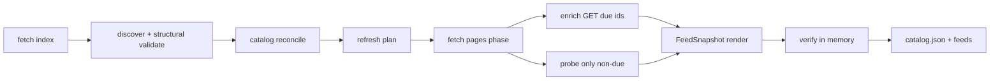

# Developer docs

Maintainer reference for **paul-graham-essay-feeds**.

| Doc | Role |
| :--- | :--- |
| [README.md](./README.md) | Users — Colab CTA + local CLI |
| [DOCS.md](./DOCS.md) | Developers (this file — architecture, CLI, CI, decisions) |
| [AGENTS.md](./AGENTS.md) | Coding agents |
| [notebook.ipynb](./notebook.ipynb) | Public Colab — Run all → `feeds.zip` |

> [!NOTE]
> There is **no** separate `docs/` directory. Architecture decisions are in
> [§ Architecture decisions](#architecture-decisions-normative) below.

> [!TIP]
> End users: start with **[Open in Colab](https://colab.research.google.com/github/wyattowalsh/paul-graham-essay-feeds/blob/main/notebook.ipynb)**
> (beautiful Run-all notebook → `feeds.zip`). This file is for architecture,
> CLI contracts, and CI.

---

## Tech stack

Full major tooling used by this repo (verified against `pyproject.toml`,
workflows, `justfile`, and `AGENTS.md`).

### Language & packaging

| Tool | Role | Links |
| :--- | :--- | :--- |
| [Python 3.12+](https://www.python.org/downloads/) | Runtime (`requires-python >=3.12`; CI matrix 3.12–3.14) | [python.org](https://www.python.org/) |
| [uv](https://github.com/astral-sh/uv) | Package manager / runner (`uv sync`, `uv run`, `uvx`) | [docs.astral.sh/uv](https://docs.astral.sh/uv/) |
| [hatchling](https://github.com/pypa/hatch) | Build backend (`[build-system]`) | [hatch.pypa.io](https://hatch.pypa.io/) |

### Runtime dependencies

| Package | Role | Links |
| :--- | :--- | :--- |
| [typer](https://github.com/fastapi/typer) | CLI (`pg-essay-feeds`) | [typer.tiangolo.com](https://typer.tiangolo.com/) |
| [httpx](https://github.com/encode/httpx) | HTTP client (index, enrich, link probes) | [www.python-httpx.org](https://www.python-httpx.org/) |
| [pydantic](https://github.com/pydantic/pydantic) | `Essay` models + validation | [docs.pydantic.dev](https://docs.pydantic.dev/) |
| [pydantic-settings](https://github.com/pydantic/pydantic-settings) | `PG_ESSAY_FEEDS_*` settings | [docs.pydantic.dev/latest/concepts/pydantic_settings](https://docs.pydantic.dev/latest/concepts/pydantic_settings/) |
| [tenacity](https://github.com/jd/tenacity) | Retries around fetches | [tenacity.readthedocs.io](https://tenacity.readthedocs.io/) |
| [tqdm](https://github.com/tqdm/tqdm) | Progress bars (enrich / render / stage) | [tqdm.github.io](https://tqdm.github.io/) |
| [loguru](https://github.com/Delgan/loguru) | Structured logging | [loguru.readthedocs.io](https://loguru.readthedocs.io/) |
| [rich](https://github.com/Textualize/rich) | CLI console + log handler | [rich.readthedocs.io](https://rich.readthedocs.io/) |

### Dev / CI

| Tool | Role | Links |
| :--- | :--- | :--- |
| [pytest](https://github.com/pytest-dev/pytest) | Test runner | [docs.pytest.org](https://docs.pytest.org/) |
| [pytest-cov](https://github.com/pytest-dev/pytest-cov) | Coverage (≥90% fail-under) | [pytest-cov.readthedocs.io](https://pytest-cov.readthedocs.io/) |
| [respx](https://github.com/lundberg/respx) | httpx mock transport | [lundberg.github.io/respx](https://lundberg.github.io/respx/) |
| [ruff](https://github.com/astral-sh/ruff) | Lint + format | [docs.astral.sh/ruff](https://docs.astral.sh/ruff/) |
| [ty](https://github.com/astral-sh/ty) | Type checker | [docs.astral.sh/ty](https://docs.astral.sh/ty/) |
| [just](https://github.com/casey/just) | Task runner (`justfile`) | [just.systems](https://just.systems/) |
| [GitHub Actions](https://github.com/features/actions) | CI + scheduled feed refresh | [docs.github.com/actions](https://docs.github.com/en/actions) |

### Feed standards

| Format | Enriched | Simple | Spec |
| :--- | :--- | :--- | :--- |
| RSS 2.0 | `feeds/rss.xml` | `feeds/rss.simple.xml` | [RSS 2.0 specification](https://www.rssboard.org/rss-specification) |
| Atom 1.0 | `feeds/atom.xml` | `feeds/atom.simple.xml` | [RFC 4287](https://datatracker.ietf.org/doc/html/rfc4287) |
| JSON Feed 1.1 | `feeds/feed.json` | `feeds/feed.simple.json` | [jsonfeed.org/version/1.1](https://www.jsonfeed.org/version/1.1/) |

Source index (context only): [paulgraham.com/articles.html](https://paulgraham.com/articles.html).

---

## Overview

CLI that **live-fetches** the official essays index, extracts items (with
structural validation), optionally enriches short summaries from each essay
page, live-checks reachability (enrich GET and/or dedicated probes), and writes
six flat RSS / Atom / JSON Feed projections under `feeds/` (enriched + simple)
plus durable `catalog.json` at the repo root (current-index mirror only).



| Stage | When | Notes |
| :--- | :--- | :--- |
| Structural validate | Always (inside discover) | Host / URL / count floor |
| Catalog reconcile | Always (default pipeline) | Durable `catalog.json` SSOT (repo root) |
| Refresh plan | Always | F-001: never skip solely on index hash |
| Fetch pages | Default validate on; `--no-validate-links` skips dedicated probes | One user-facing phase: enrich GET = check + summary for due IDs; dedicated probes only for URLs not enriched this run. Report-only; never drop essays |
| Enrich | Default on; planned pages only | Prior-good summary retained; page GET is the reachability check for those URLs |
| Publish | Verify both snapshots → write six `feeds/*` → `catalog.json` | Catalog is SSOT (index mirror); feeds are projections. No generation tree / `current.json` |

> [!TIP]
> CI and offline smoke use `--no-enrich` (and typically `--no-validate-links`
> offline). Reachability checks default on; failures are reported without failing
> the update.

---

## Architecture

### End-to-end pipeline

```text
raw fetch → decode → discover → catalog reconcile → refresh plan
  → fetch pages (enrich GET = check+summary; probe only non-enrich URLs)
  → FeedSnapshot (enriched + simple) → RSS/Atom/JSON ×2
  → deep verify both → project feeds/ (6 files) + durable catalog
```

```text
catalog.json              # durable SSOT (repo root) — mirrors current index
feeds/rss.xml|atom.xml|feed.json                 # enriched
feeds/rss.simple.xml|atom.simple.xml|feed.simple.json  # simple (title/link)
# no site/* · no state/generations/ · no current.json · no feeds/validated/
```

### Package layout (`src/paul_graham_essay_feeds/`)

| Module | Responsibility |
| :--- | :--- |
| `models.py` | Schema SSOT: Catalog/DiscoveryItem/Essay/FeedSnapshot, ExitCode, ProgressReporter, URL/time helpers |
| `settings.py` | `Settings` (`PG_ESSAY_FEEDS_*`) |
| `http.py` | hop-safe HTTP, evidence, decode, retry, index fetch |
| `discover.py` | index HTML (**selectolax**) → ordered `DiscoveryItem`s; marker/fail-closed F-017 |
| `enrich.py` | page scrape (**selectolax**) → short summary + `published_hint`; link probes |
| `catalog.py` | atomic root `catalog.json` I/O + reconcile + refresh + bootstrap-from-feeds |
| `feeds.py` | snapshot-native RSS/Atom/JSON render + write |
| `verify.py` | deep in-memory cross-format verification |
| `pipeline.py` | orchestrate + verify-then-atomic root catalog + feeds |
| `cli.py` | Typer: `update` / `check` only |

Entry points: `cli:main` / `__main__.py`. Schema SSOT is Pydantic `models.py` (no parallel JSON Schema tree).

### Artifacts

| Path | Role |
| :--- | :--- |
| `catalog.json` | Durable catalog SSOT (repo root) — current index only |
| `feeds/` | Six flat projections: enriched + simple (see AD-002) |
| `.cache/` | Gitignored HTTP validator sidecar |
| `notebook.ipynb` | Public Colab (HTML intro + generate → `feeds.zip`) |

### State publication

| Path | Git |
| :--- | :--- |
| `catalog.json` | **Commit** — durable SSOT (repo root; index mirror) |
| `feeds/*` | **Commit** — six flat feed projections (enriched + simple) |
| `.cache/` | **Do not commit** — HTTP validator sidecar |

Publish order (AD-005): verify both snapshots in memory → write six `feeds/*` →
write `catalog.json`. Catalog is SSOT; feeds are projections. No `site/`
artifact, no `state/generations/`, no `current.json`, no `feeds/validated/`.

---

## CLI reference

```bash
pg-essay-feeds update    [OPTIONS]
pg-essay-feeds check     [OPTIONS]
```

### Precedence

```text
COMMANDLINE > pydantic-settings env / .env > field defaults
```

Flags override Settings **only when explicitly passed**. Two patterns (not every
flag uses `_is_cmdline`):

| Pattern | Flags | Mechanism |
| :--- | :--- | :--- |
| **None-sentinel dual bools** | `--enrich/--no-enrich`, `--validate-links/--no-validate-links`, `--force/--no-force` | Typer `bool \| None = None`; omitted → keep Settings/env |
| **Cmdline-gated defaults** | `-q` / `--quiet`, `-v` / `--verbose` | Typer `bool = False`; `_cmdline_or_none` applies only when `ParameterSource.COMMANDLINE` |

Optional scalars (`--repo-root`, `--min-items`, `--timeout`, …) use `T | None = None`
the same way as dual bools. If both quiet and verbose end up true, quiet wins.

> [!NOTE]
> Env-only knobs (no CLI flags): `STALE_AFTER_DAYS`, `LINK_WORKERS`,
> `ENRICH_WORKERS`, `MAX_BYTES`, `ALLOW_DISCOVERY_FALLBACK` (all under
> `PG_ESSAY_FEEDS_*`). See [§ Configuration](#configuration).

### `update`

| Flag | Default | Meaning |
| :--- | :--- | :--- |
| `--repo-root PATH` | cwd / env | Output root for `feeds/` + `catalog.json` |
| `--source-file PATH` | — | Local HTML instead of network fetch |
| `--min-items INT` | `Settings.min_items` (`MIN_ITEMS`) | Fail if fewer items |
| `--timeout FLOAT` | `30` | HTTP timeout (seconds) |
| `--retries INT` | `3` | Extra attempts after first |
| `--enrich` / `--no-enrich` | enrich on (env) | Per-page short summary scrape |
| `--force` / `--no-force` | off (env) | Bypass refresh-planner no-op (marks work due; not an index-hash skip) |
| `--validate-links` / `--no-validate-links` | on (env) | Live HEAD/GET; report-only; never drop essays |
| `--public-base-url URL` | env / unset | Public base for self links |
| `--from-feeds` | off | Bootstrap durable catalog from existing `feeds/` before update |
| `--result-file PATH` | — | Append `action=unchanged\|updated`; also writes `$GITHUB_OUTPUT` when set (quiet success side-channel) |
| `-q` / `--quiet` | off (env) | Quiet success → zero stdout **and** stderr; errors only; result-file / `$GITHUB_OUTPUT` still write |
| `-v` / `--verbose` | off (env) | Debug logs |

### `check`

Deep-verifies both enriched and simple `feeds/` sets (item-count parity across
RSS/Atom/JSON; enriched JSON `content_text` == `summary` with length in
`[1, FEED_SUMMARY_CHARS]`). When root `catalog.json` is present, also loads it
and asserts `entry_order` ids match ordered ids in both `feed.json` and
`feed.simple.json`. No `site/` requirement.

| Flag | Default | Meaning |
| :--- | :--- | :--- |
| `--repo-root PATH` | cwd / env | Root containing `feeds/` |
| `--min-items INT` | `Settings.min_items` (`MIN_ITEMS`) | Floor for item count |
| `-q` / `--quiet` | off (env) | Quiet success → zero stdout **and** stderr; errors only |
| `-v` / `--verbose` | off (env) | Debug logs |

---

## Configuration

`Settings` loads env vars with prefix **`PG_ESSAY_FEEDS_`** (optional `.env`).

Env-only (no CLI flag): `MAX_BYTES`, `LINK_WORKERS`, `ENRICH_WORKERS`, `STALE_AFTER_DAYS`, `ALLOW_DISCOVERY_FALLBACK` (plus `LINK_TIMEOUT` / `ENRICH_TIMEOUT`).

| Env var | Default | Notes |
| :--- | :--- | :--- |
| `PG_ESSAY_FEEDS_SOURCE_URL` | official articles.html | Index URL |
| `PG_ESSAY_FEEDS_REPO_ROOT` | cwd | Resolved absolute path |
| `PG_ESSAY_FEEDS_MIN_ITEMS` | `MIN_ITEMS` (`models.py`) | Safety floor (not live catalog size) |
| `PG_ESSAY_FEEDS_TIMEOUT` | `30` | Index fetch timeout |
| `PG_ESSAY_FEEDS_RETRIES` | `3` | Tenacity attempts = retries+1 |
| `PG_ESSAY_FEEDS_MAX_BYTES` | 5 MiB | Response size cap (env-only) |
| `PG_ESSAY_FEEDS_VALIDATE_LINKS` | `true` | Live probes (report-only; `--no-validate-links` to skip) |
| `PG_ESSAY_FEEDS_LINK_TIMEOUT` | `10` | Per-probe timeout |
| `PG_ESSAY_FEEDS_LINK_WORKERS` | `4` | Live-probe thread pool (not enrich; env-only) |
| `PG_ESSAY_FEEDS_ENRICH` | `true` | Per-page short summary scrape |
| `PG_ESSAY_FEEDS_ENRICH_WORKERS` | `4` | Enrich thread pool (env-only) |
| `PG_ESSAY_FEEDS_ENRICH_TIMEOUT` | `15` | Per-page timeout |
| `PG_ESSAY_FEEDS_FORCE` | `false` | Bypass refresh-planner no-op (not an index-hash skip) |
| `PG_ESSAY_FEEDS_PUBLIC_BASE_URL` | unset | Public base for feed self links |
| `PG_ESSAY_FEEDS_STALE_AFTER_DAYS` | `30` | Re-fetch page metadata after N days (env-only; update-feeds.yml sets `90`) |
| `PG_ESSAY_FEEDS_ALLOW_DISCOVERY_FALLBACK` | `true` | Sparse-marker discovery fallback (env-only) |
| `PG_ESSAY_FEEDS_QUIET` / `PG_ESSAY_FEEDS_VERBOSE` | false | Log levels |

```bash
export PG_ESSAY_FEEDS_MIN_ITEMS=10   # optional: lower extract/check floor
export PG_ESSAY_FEEDS_ENRICH=false   # optional: skip per-page scrapes
```

### Latency & cost

| Mode | Network | Notes |
| :--- | :--- | :--- |
| Default (`ENRICH=true`, checks on) | Index + ~1 GET/essay; dedicated probes only for URLs not enriched this run | Richest short descriptions; reachability failures warn only |
| `--no-enrich` / `PG_ESSAY_FEEDS_ENRICH=false` | Index (+ probes unless disabled) | Fast; generic blurbs when no summary |
| Not due (catalog planner) | Index GET (or local read) only | No material catalog deltas and no page fetches planned → skip rewrite |
| `--force` / `PG_ESSAY_FEEDS_FORCE=true` | Full pipeline | Bypass refresh-planner no-op (not index-hash skip) |
| `--no-validate-links` | Skip dedicated HEAD/GET probes | Default checks are report-only and never drop essays |

CI and offline smoke use `--no-enrich` (and often `--no-validate-links`). Reachability
checks default on; failures are logged without failing the update.

### Change detection (catalog planner — F-001)

- **SSOT:** `catalog.json` mirrors the current index + per-page resource state + prior-good summaries.
- **Refresh plan:** marks `STALE` / `MISSING_METADATA` / `FORCE` / `CANARY` independently of
  index identity. Index-only hash equality is **not** a valid skip reason when page work is due.
- **Publication:** verify both snapshots → project six `feeds/*` → durable
  `catalog.json` (catalog SSOT; feeds are projections).

> [!NOTE]
> There is **no** `data/essays.json`. Operational state lives in the durable catalog,
> not as feed-body SSOT.

---

## Feeds contract

### Item fields (all formats)

| Field | Required | Source |
| :--- | :--- | :--- |
| title | yes | index |
| link / url | yes | https, allowlisted host |
| guid / id | yes | URL or Turbify path UUID |
| description / summary | yes | `feed_summary()` (enrich or generic blurb, ≤~400 chars) |
| JSON `content_text` | yes | same short `feed_summary()` (not full essay body) |
| `published_hint` | no | enrich metadata only (not emitted in feeds); month+year string |
| pubDate / published / date_published | no | only when `published_at` is set (real full calendar day) |

### Dates

- Month+year on the page → **`published_hint` only** (enrich metadata; not a feed field).
- Enrich **never** invents a day-1 `published_at` from month+year.
- Feed dates (`pubDate` / Atom `<published>` / JSON `date_published`) emit **only** when
  `published_at` is set. Enrich leaves `published_at` unset today (no full-day source).
- Month+year does **not** become a feed date.

### Atom / feed-level timestamps (catalog pipeline)

| Element | Value |
| :--- | :--- |
| Feed `<updated>` / RSS `lastBuildDate` | generation `logical_updated_at` (max item observation), not wall-clock |
| Entry `<updated>` | `observed_updated_at` (truthful; never 1970 sentinel) |
| Entry `<published>` / RSS `pubDate` / JSON `date_published` | only when exact `published_at` is set |

> [!WARNING]
> Month+year never invents a day-1 `published_at`. Bootstrap observation uses the
> labeled migration clock, not epoch sentinels.

### Writes & verify

1. Verify enriched and simple RSS/Atom/JSON **in memory** (structure, parity,
   uniqueness, summary bounds).
2. Project six flat `feeds/*` files, then durable `catalog.json`.

CLI `check` validates both `feeds/` projections (count parity, enriched
`content_text` bounds) and, when `catalog.json` is present, asserts
`entry_order` id parity with both JSON feeds. Deep verify runs before write.

### Feed identity (Atom)

The Atom feed `<id>` is the constant `FEED_ID` in `models.py`
(`tag:wyattowalsh.github.io,2026:paul-graham-essay-feeds`). That tag string is a
**permanent feed identity** for readers, not a claim that a site is hosted on
github.io. Do not change it casually — swapping Atom ids breaks reader state.

### Non-goals

| Non-goal | Rationale |
| :--- | :--- |
| Full essay bodies | Metadata-only feeds |
| OPML | Out of scope |
| Invented feed dates from month+year | No day-1 fiction |
| `data/essays.json` | Durable state is `catalog.json` |
| Feed-embedded operational SSOT | Catalog is SSOT; feeds are projections |

> [!NOTE]
> JSON Feed items **do** include short `content_text` (= `summary`). That is
> metadata-only, not the full essay. Optional `public_base_url` enables self/feed
> absolute URLs.

### HTTP safety

Shared `hop_safe_request` (and `hop_safe_get` wrapper): `follow_redirects=False`,
every hop host must be in the caller allowlist. `allow_loopback` is **start-bound**:
defaulted once from the start URL host, then fixed for every hop including the final
URL. Redirect responses are **closed without reading the body**. When `max_bytes` is
set, the final response is streamed with `Content-Length` reject (when present) plus a
streaming hard-stop and a final length check. Live HEAD probes pass the same
`max_bytes` budget. Clients use `trust_env=False`. Local `--source-file` uses the same
byte cap.

| Traffic | `allowed_hosts` |
| :--- | :--- |
| Index fetch | `{paulgraham.com}` |
| Enrich + live probes | `ALLOWED_HOSTS` (`paulgraham.com`, `sep.turbifycdn.com`) |

Turbify query strings are stripped for stable identity.

---

## Testing

| Layer | Path | Network |
| :--- | :--- | :--- |
| unit | `tests/unit/test_<module>.py` (mirrors package modules) | no |
| integration | `tests/integration/` | local HTTP only |
| e2e | `tests/test_cli_e2e.py` | no (CLI + fixtures) |
| smoke | `tests/smoke/` | no |
| live | `tests/test_live_fetch.py` | **yes** (opt-in) |

```bash
just test          # default: not live, cov ≥ 90%
just test-unit
just test-integration
just test-e2e
just test-smoke
just test-live     # hits paulgraham.com
just cov
```

`notebook.ipynb` is excluded from ruff (`extend-exclude`).

> [!IMPORTANT]
> Unit tests are a **flat mirror** of package modules:
> `tests/unit/test_<module>.py` ↔ `src/paul_graham_essay_feeds/<module>.py`.
> No nested `tests/unit/paul_graham_essay_feeds/` unless the package gains
> subpackages.

---

## CI & local quality gates

### GitHub Actions

| Workflow | Role |
| :--- | :--- |
| `ci.yml` | matrix 3.12–3.14; lint/types (3.13); pytest + cov ≥90%; committed-feed `check` on `feeds/`; offline catalog smoke (`feeds/` + `catalog.json`); assert no `feeds/validated/`; dist job |
| `release.yml` | on tag `v*`: version match, quality gates, `uv build --no-sources`, wheel smoke, GitHub Release |
| `update-feeds.yml` | scheduled live refresh → validate → commit `feeds/` + `catalog.json` to `main` |
| Dependabot | weekly `uv` + `github-actions` |

CI policy: exit 0 on matrix; full-SHA action pins; least privilege on generation jobs;
multi-line scripts use `set -euo pipefail`. Coverage fail-under is enforced on full
suite entrypoints (CI / `just test` / `just ci-local`), not on partial path selection.

> [!NOTE]
> GitHub Actions auto-sets `$GITHUB_OUTPUT` for step outputs. `update --quiet` still
> appends `action=unchanged|updated` there (and to `--result-file` when passed).
> Settings default `STALE_AFTER_DAYS=30`; `update-feeds.yml` overrides to `90` so
> daily runs do not mass re-enrich on day 31 when the index is unchanged.

### just recipes

| Recipe | Action |
| :--- | :--- |
| `sync` | `uv sync --all-groups` |
| `lint` | ruff format check + ruff check |
| `type` | `ty check` |
| `test` | pytest + **cov ≥ 90%** |
| `ci-local` | locked sync + lint + type + test + quiet check + build |
| `check` | `pg-essay-feeds check` |
| `update` | live `pg-essay-feeds update` |
| `build` | `uv build --no-sources` + wheel smoke |
| `all` | lint + type + test + check |

Quality order: **format → lint → types → tests → check**.

```bash
uv sync --locked --all-groups
uv run ruff format --check .
uv run ruff check .
uv run ty check
uv run pytest --cov-fail-under=90
uv run pg-essay-feeds check --quiet
uv build --no-sources
```

---

## Notebook

[`notebook.ipynb`](./notebook.ipynb) is the **public Colab product** (same
filename as the README hero badge) — audience is feed-reader users, not
maintainers:

1. HTML hero (`IPython.display.HTML`, `#@title` + `cellView: form` so code stays
   hidden) — brand, unofficial disclaimer, how-to, RSS / Atom / JSON what-you-get
   (enriched + `*.simple.*` under `feeds/`), metadata-only honesty; notes
   `catalog.json` on disk and zip packaging
2. Form cell (`#@title` + `cellView: form`): **Enrich**, **Auto-download**;
   `ROOT` under Advanced (default `/content/pg-feeds`)
3. `!pip install -q "uv>=0.12"` → `subprocess` `uvx … update` (capture + print
   logs; `+ --no-enrich` when off; **do not** pass `--no-validate-links` —
   package default `validate_links=True`; fetch-pages phase: enrich GET =
   check + summary for due IDs, dedicated probes only for non-enriched URLs) →
   `uvx … check` → assert six `feeds/{rss,atom,feed}{,.simple}.*` → zip all six →
   optional Colab download when `AUTO_DOWNLOAD`
4. Status HTML after the zip (report-only): **green** when logs show reachability
   OK / no failure lines; **amber** panel with failure count + up to
   ~10 `Link probe issue:` messages when checks fail — zip still downloads
5. Troubleshooting cell (`#@title` + form-hidden HTML `<details>`)

No package API imports in the kernel; CLI only via `uvx` from floating `main`.
`notebook.ipynb` stays ruff/ty-excluded.

---

## Release / maintenance

1. `just all` green on a clean tree
2. Optional: refresh committed `feeds/` (see below)
3. `pg-essay-feeds check` (parity + `content_text`)
4. Commit when ready (user-gated) — ship **check + regenerated feeds together**
5. Push an annotated tag `vX.Y.Z` matching `__version__` (e.g. `0.1.0` →
   `v0.1.0`) → `.github/workflows/release.yml` asserts the tag↔version match,
   runs the same quality gates as CI, then builds wheel/sdist, creates a
   GitHub Release via softprops with **auto-generated release notes** (from
   commits/PRs since the previous tag), and attaches `dist/*`. No `uv publish`
   on tag.

```bash
just build   # local: uv build --no-sources + wheel smoke
```

> [!NOTE]
> Hatch sdist excludes `/feeds`, `/.github`, `/.venv`, and `/dist`. That does
> **not** break `uvx --from git+…`: git install still clones the full repo
> (committed feeds available locally); installed wheels write `feeds/` at runtime.

### Regenerating committed feeds

```bash
uv run pg-essay-feeds update --force
uv run pg-essay-feeds check --quiet
```

Expectations after regen:

- Every JSON item has short `content_text` (== `summary`).
- `date_published` / RSS `pubDate` / Atom `<published>` are **absent** unless a real
  full-day `published_at` exists (enrich sets month+year `published_hint` only).
- Atom entry `<updated>` is truthful `observed_updated_at` (no 1970 sentinel).
- Durable catalog under `catalog.json` (current index only; no lifecycle keys).
- Six flat projections under `feeds/`:
  `rss.xml` / `atom.xml` / `feed.json` (enriched) and
  `rss.simple.xml` / `atom.simple.xml` / `feed.simple.json` (simple).
  No `feeds/validated/` or other subdirectory trees.
- Tag `v{version}` must match package `__version__` for release.

> [!WARNING]
> Be polite to paulgraham.com: defaults use `ENRICH_WORKERS=4` /
> `LINK_WORKERS=4`; avoid hammering live probes unless diagnosing.

CI runs `pg-essay-feeds check` on the committed `feeds/` tree. Do not land code that
requires `content_text` without matching regenerated artifacts in the same change.

---

## Troubleshooting

| Symptom | Likely cause | Fix |
| :--- | :--- | :--- |
| `Only N essays (need ≥ min_items)` | index HTML incomplete / markers changed | Inspect source; temporary `--min-items` only after review |
| Enrich warnings / thin descriptions | page fetch failed or sparse HTML | Retry; or `--no-enrich` for index-only |
| Env enrich/validate ignored | flag always passed historically | Pass flags only when overriding; check `PG_ESSAY_FEEDS_*` |
| Turbify-looking double URL | relative join bug | Should be impossible post-canonicalize; open an issue with HTML snippet |
| Missing / empty durable catalog | bootstrap needed from existing feeds | `update --from-feeds` once, then normal `update` |
| Empty action / `UNCHANGED` | refresh planner not due (no material work) | Expected; use `--force` / `FORCE=true` to bypass planner no-op |
| Want mass re-enrich | planner skipped pages (not stale) | `update --force` (bypasses planner no-op; not an index-hash myth) |
| Quiet run but saw output | logging/side-channel, not console success | Errors still print; `--result-file` / `$GITHUB_OUTPUT` write under `-q` |
| `check` missing files | never ran `update` in that root | `update --repo-root …` first |
| `check` count / `content_text` / id parity fail | tear window or partial copy | Re-run `update`; ensure all six feeds ship with `catalog.json` |
| Colab zip missing | generate cell not run / update failed | Re-run generate (or Run all); confirm `feeds/` under Advanced `ROOT` |
| Ruff wants to touch notebook | excluded by design | `extend-exclude = ["notebook.ipynb"]` |

---

## Architecture decisions (normative)

All architecture decisions live **in this file** (no separate `docs/` tree). Numbered
for cross-reference from code comments only.

### AD-001 — Feed contract

Emit metadata-only **RSS 2.0**, **Atom 1.0**, and **JSON Feed 1.1** from one immutable
`FeedSnapshot`.

| Field | Source | RSS | Atom | JSON Feed |
| :--- | :--- | :--- | :--- | :--- |
| Stable id | catalog identity | `guid` | `id` | `id` |
| URL | allowlisted HTTPS | `link` | `link rel=alternate` | `url` |
| Title | index/page | `title` | `title` | `title` |
| Summary | short source text | `description` | `summary` | `summary` + `content_text` |
| Published | exact `published_at` only | `pubDate` if set | `published` if set | `date_published` if set |
| Updated | `observed_updated_at` | — | `updated` (required, truthful) | `date_modified` if set |

Feed-level `lastBuildDate` / Atom feed `updated` = generation `logical_updated_at`.
Self/feed URLs only when `public_base_url` is set. Cross-format ordered parity for
id/url/title/summary. No full bodies; no invented dates; no 1970 entry `updated`.

### AD-002 — Catalog SSOT

Schema-versioned **`catalog.json`** is durable SSOT (Pydantic in
`models.py`). Membership mirrors the **current** articles index only: essays
absent from the latest discovery pass are **hard-deleted** from the catalog (no
lifecycle / soft-retain / tombstones). Prior enrichment is reused when an id is
still on the index. Preserve prior-good summary on recoverable enrich failures.
Index-only skip is **invalid**; refresh planning uses catalog + page state (F-001).

Feed projections (both deep-verified before write):

| Files | Kind |
| :--- | :--- |
| `feeds/rss.xml`, `atom.xml`, `feed.json` | enriched summaries |
| `feeds/rss.simple.xml`, `atom.simple.xml`, `feed.simple.json` | title/link only |

### AD-003 — Time and identity

| Field | Meaning | Public use |
| :--- | :--- | :--- |
| `first_seen_at` / `last_seen_at` | index observation | catalog only |
| `last_checked_at` | request attempt | never content time |
| `observed_updated_at` | material metadata change | Atom entry `updated` |
| `published_at` | exact trustworthy date only | feed published fields |
| `logical_updated_at` | generation material clock | feed-level updated |

Aware UTC only; month-year → `published_hint` only. Stable id = permalink URL (PG) or
UUID URN (protected Turbify ACL chapters). Normalize `www` → apex; strip fragments.

### AD-004 — HTTP policy

- `trust_env=False`; hop-safe host allowlist; HTTPS (loopback HTTP test-only).
- HEAD must **not** treat representation `Content-Length` as body budget (F-016).
- GET hard-caps transferred bytes; shared decoder (BOM → transport charset → meta →
  UTF-8 → Windows-1252 fallback); quarantine unexpected U+FFFD.
- Retry idempotent transients only; honor bounded `Retry-After`; full jitter otherwise.
- Persist ETag/Last-Modified/hashes; conditional GET / 304 as check evidence only.

### AD-005 — Publication

```text
verify enriched + simple in memory → write six feeds/* → write catalog.json
```

Feeds-then-catalog: projections land before the durable catalog stamp. This is
**not** a multi-file atomic transaction — a crash between feed replaces and
`catalog.json` can leave feeds ahead of the catalog (`check` catches
`entry_order` id parity vs both JSON feeds). Failure before any durable replace
leaves prior catalog + feeds intact. No second feed tree, no generation tree,
no `current.json`, no `site/`, no `feeds/validated/`.

Material-noop after enrich may still `save_catalog` so page clocks advance even
when feed bytes are unchanged.

### AD-006 — CLI and Python

- Python **3.12–3.14** (`requires-python >=3.12`); ship `py.typed`.
- Commands: `update` + `check` only (no `site` / legacy pipeline escape hatches).
- Flags override Settings only when explicitly passed (None-sentinel dual bools
  **or** `_cmdline_or_none` for quiet/verbose — see [§ Precedence](#precedence)).
- Quiet success → **zero bytes** on stdout **and** stderr. Carve-out:
  `--result-file` and `$GITHUB_OUTPUT` still append `action=…` under `--quiet`.

| Exit | Meaning |
| :--- | :--- |
| `0` | Success |
| `1` | `ConfigurationError` / plain `FeedError` / `ValidationError` (usage) |
| `2` | `VerificationError` |
| `3` | `NetworkSourceError` |
| `4` | `OSError` / internal |

### AD-007 — Governance

- MIT covers **code**, not Paul Graham essays.
- Short source-derived summaries only; no full-body storage.
- Release tags must match package version; user-facing CHANGELOG only.
- Scheduled automation commits deterministic `catalog.json` + `feeds/` to `main`.

### AD-008 — CI clean

Matrix 3.12/3.13/3.14; full-SHA pins; least privilege; offline suite default;
coverage ≥90% on full suite; `pg-essay-feeds check` on committed feeds; offline smoke
asserts catalog pipeline + feed projections under `feeds/`.

---

## Related files

| Path | Role |
| :--- | :--- |
| [README.md](./README.md) | Users — Colab hero + local CLI |
| [DOCS.md](./DOCS.md) | Developers (this file; single SSOT including architecture decisions) |
| [AGENTS.md](./AGENTS.md) | Coding agents |
| [notebook.ipynb](./notebook.ipynb) | Public Colab — Run all → `feeds.zip` |
| [LICENSE](./LICENSE) | MIT |
