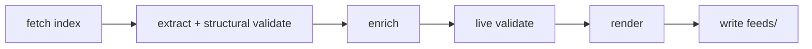

# Developer docs

Maintainer reference for **paul-graham-essay-feeds**.

| Doc | Role |
| :--- | :--- |
| [README.md](./README.md) | Users — Colab CTA + local CLI |
| [DOCS.md](./DOCS.md) | Developers (this file) |
| [AGENTS.md](./AGENTS.md) | Coding agents |
| [notebook.ipynb](./notebook.ipynb) | Colab / Jupyter — zero-install runner |

> [!TIP]
> End users: start with **[Open in Colab](https://colab.research.google.com/github/wyattowalsh/paul-graham-essay-feeds/blob/main/notebook.ipynb)**
> (no install). This file is for architecture, CLI contracts, and CI.

---

## Tech stack

Full major tooling used by this repo (verified against `pyproject.toml`,
workflows, `justfile`, and `AGENTS.md`).

### Language & packaging

| Tool | Role | Links |
| :--- | :--- | :--- |
| [Python 3.13](https://www.python.org/downloads/) | Runtime (`requires-python >=3.13`) | [python.org](https://www.python.org/) |
| [uv](https://github.com/astral-sh/uv) | Package manager / runner (`uv sync`, `uv run`, `uvx`) | [docs.astral.sh/uv](https://docs.astral.sh/uv/) |
| [hatchling](https://github.com/pypa/hatch) | Build backend (`[build-system]`) | [hatch.pypa.io](https://hatch.pypa.io/) |

### Runtime dependencies

| Package | Role | Links |
| :--- | :--- | :--- |
| [typer](https://github.com/fastapi/typer) | CLI (`pg-essay-feeds`) | [typer.tiangolo.com](https://typer.tiangolo.com/) |
| [httpx](https://github.com/encode/httpx) | HTTP client (index, enrich, link probes) | [www.python-httpx.org](https://www.python-httpx.org/) |
| [pydantic](https://github.com/pydantic/pydantic) | `Essay` models + validation | [docs.pydantic.dev](https://docs.pydantic.dev/) |
| [pydantic-settings](https://github.com/pydantic/pydantic-settings) | `PG_ESSAY_FEEDS_*` settings | [docs.pydantic.dev/latest/concepts/pydantic_settings](https://docs.pydantic.dev/latest/concepts/pydantic_settings/) |
| [tenacity](https://github.com/jd/tenacity) | Retries around fetches | [tenacity.readthedocs.io](https://tenacity.readthedocs.io/) |
| [tqdm](https://github.com/tqdm/tqdm) | Progress bars (enrich / render / stage) | [tqdm.github.io](https://tqdm.github.io/) |
| [loguru](https://github.com/Delgan/loguru) | Structured logging | [loguru.readthedocs.io](https://loguru.readthedocs.io/) |
| [rich](https://github.com/Textualize/rich) | CLI console + log handler | [rich.readthedocs.io](https://rich.readthedocs.io/) |

### Dev / CI

| Tool | Role | Links |
| :--- | :--- | :--- |
| [pytest](https://github.com/pytest-dev/pytest) | Test runner | [docs.pytest.org](https://docs.pytest.org/) |
| [pytest-cov](https://github.com/pytest-dev/pytest-cov) | Coverage (≥90% fail-under) | [pytest-cov.readthedocs.io](https://pytest-cov.readthedocs.io/) |
| [respx](https://github.com/lundberg/respx) | httpx mock transport | [lundberg.github.io/respx](https://lundberg.github.io/respx/) |
| [ruff](https://github.com/astral-sh/ruff) | Lint + format | [docs.astral.sh/ruff](https://docs.astral.sh/ruff/) |
| [ty](https://github.com/astral-sh/ty) | Type checker | [docs.astral.sh/ty](https://docs.astral.sh/ty/) |
| [just](https://github.com/casey/just) | Task runner (`justfile`) | [just.systems](https://just.systems/) |
| [GitHub Actions](https://github.com/features/actions) | CI + scheduled feed refresh | [docs.github.com/actions](https://docs.github.com/en/actions) |

### Feed standards

| Format | Artifact | Spec |
| :--- | :--- | :--- |
| RSS 2.0 | `feeds/rss.xml` | [RSS 2.0 specification](https://www.rssboard.org/rss-specification) |
| Atom 1.0 | `feeds/atom.xml` | [RFC 4287](https://datatracker.ietf.org/doc/html/rfc4287) |
| JSON Feed 1.1 | `feeds/feed.json` | [jsonfeed.org/version/1.1](https://www.jsonfeed.org/version/1.1/) |

Source index (context only): [paulgraham.com/articles.html](https://paulgraham.com/articles.html).

---

## Overview

CLI that **live-fetches** the official essays index, extracts items (with
structural validation), optionally enriches short summaries from each essay
page, optionally live-probes links, and writes RSS / Atom / JSON Feed artifacts
under a repo root.



| Stage | When | Notes |
| :--- | :--- | :--- |
| Structural validate | Always (inside extract) | Host / URL / count floor |
| Enrich | Default on | Per-page short summary |
| Live link probes | Opt-in (`--validate-links`) | After enrich |
| Write | After render | Atomic stage → `os.replace` |

> [!TIP]
> CI and offline smoke use `--no-enrich`. Live probes stay opt-in.

---

## Architecture

### Package layout (8 domain modules)

| Module | Responsibility |
| :--- | :--- |
| `model.py` | `Essay`, constants, URL/id helpers, Atom sentinel |
| `settings.py` | `Settings` via pydantic-settings (`PG_ESSAY_FEEDS_*`) |
| `fetch.py` | httpx + `hop_safe_request` / `hop_safe_get` + Tenacity |
| `validate.py` | structural checks (via extract) + optional live probes |
| `extract.py` | index HTML → ordered `Essay` list → structural validate |
| `enrich.py` | per-page scrape → short summary; month+year → `published_hint` only |
| `feeds.py` | render RSS/Atom/JSON + atomic write + `verify_feed_artifacts` |
| `cli.py` | Typer app + loguru/Rich logging; `check` → `verify_feed_artifacts` |

Entry points: `cli:main` / `__main__.py`.

Artifacts (not package code):

| Path | Role |
| :--- | :--- |
| `feeds/` | `rss.xml`, `atom.xml`, `feed.json` |
| `notebook.ipynb` | Colab/Jupyter: live-generate + download |

### Import DAG (acyclic)

```text
model ← settings
model ← fetch
model ← validate ← fetch.hop_safe_* / run_with_retry
model ← extract ← validate (structural)
model ← enrich ← fetch.hop_safe_get / run_with_retry
model ← feeds
cli ← settings, fetch, extract, enrich, validate, feeds
```

---

## CLI reference

```bash
pg-essay-feeds update [OPTIONS]
pg-essay-feeds check  [OPTIONS]
```

### Precedence

```text
COMMANDLINE > pydantic-settings env / .env > field defaults
```

Flags override Settings **only when explicitly passed** (`ParameterSource.COMMANDLINE`).
Bool defaults on Typer options must not clobber env (e.g. `PG_ESSAY_FEEDS_ENRICH=false`
survives unless `--enrich` / `--no-enrich` is on the command line). Dual bools use
`--enrich/--no-enrich` and `--validate-links/--no-validate-links` with
`bool | None = None`. If both quiet and verbose end up true, quiet wins.

### `update`

| Flag | Default | Meaning |
| :--- | :--- | :--- |
| `--repo-root PATH` | cwd / env | Output root for `feeds/` |
| `--source-file PATH` | — | Local HTML instead of network fetch |
| `--min-items INT` | `Settings.min_items` (`MIN_ITEMS`) | Fail if fewer items |
| `--timeout FLOAT` | `30` | HTTP timeout (seconds) |
| `--retries INT` | `3` | Extra attempts after first |
| `--enrich` / `--no-enrich` | enrich on (env) | Per-page short summary scrape |
| `--validate-links` / `--no-validate-links` | off (env) | Live HEAD/GET each essay URL |
| `-q` / `--quiet` | off (env) | Errors only |
| `-v` / `--verbose` | off (env) | Debug logs |

### `check`

Runs `verify_feed_artifacts` on `feeds/` (item-count parity across RSS/Atom/JSON,
plus JSON `content_text` == `summary` with length in `[1, FEED_SUMMARY_CHARS]`).

| Flag | Default | Meaning |
| :--- | :--- | :--- |
| `--repo-root PATH` | cwd / env | Root containing `feeds/` |
| `--min-items INT` | `Settings.min_items` (`MIN_ITEMS`) | Floor for item count |
| `-q` / `--quiet` | off (env) | Errors only |
| `-v` / `--verbose` | off (env) | Debug logs |

---

## Configuration

`Settings` loads env vars with prefix **`PG_ESSAY_FEEDS_`** (optional `.env`).

| Env var | Default | Notes |
| :--- | :--- | :--- |
| `PG_ESSAY_FEEDS_SOURCE_URL` | official articles.html | Index URL |
| `PG_ESSAY_FEEDS_REPO_ROOT` | cwd | Resolved absolute path |
| `PG_ESSAY_FEEDS_MIN_ITEMS` | `MIN_ITEMS` (`model.py`) | Safety floor (not live catalog size) |
| `PG_ESSAY_FEEDS_TIMEOUT` | `30` | Index fetch timeout |
| `PG_ESSAY_FEEDS_RETRIES` | `3` | Tenacity attempts = retries+1 |
| `PG_ESSAY_FEEDS_MAX_BYTES` | 5 MiB | Response size cap |
| `PG_ESSAY_FEEDS_VALIDATE_LINKS` | `false` | Live probes |
| `PG_ESSAY_FEEDS_LINK_TIMEOUT` | `10` | Per-probe timeout |
| `PG_ESSAY_FEEDS_LINK_WORKERS` | `4` | Live-probe thread pool (not enrich) |
| `PG_ESSAY_FEEDS_ENRICH` | `true` | Per-page short summary scrape |
| `PG_ESSAY_FEEDS_ENRICH_WORKERS` | `4` | Enrich thread pool |
| `PG_ESSAY_FEEDS_ENRICH_TIMEOUT` | `15` | Per-page timeout |
| `PG_ESSAY_FEEDS_FORCE` | `false` | Bypass hash-based skip when index unchanged |
| `PG_ESSAY_FEEDS_QUIET` / `PG_ESSAY_FEEDS_VERBOSE` | false | Log levels |

```bash
export PG_ESSAY_FEEDS_MIN_ITEMS=10   # optional: lower extract/check floor
export PG_ESSAY_FEEDS_ENRICH=false   # optional: skip per-page scrapes
```

### Latency & cost

| Mode | Network | Notes |
| :--- | :--- | :--- |
| Default (`ENRICH=true`) | ~1 HTTP GET per essay (catalog size varies) + index GET | Richest short descriptions; uses `ENRICH_WORKERS` (default 4) |
| `--no-enrich` / `PG_ESSAY_FEEDS_ENRICH=false` | Index only | Fast; generic blurbs when no summary |
| Unchanged index | Index GET (or local read) only | SHA-256 of index HTML + item fingerprint match `feed.json` `_pg_essay_feeds` → skip enrich/write |
| `--force` / `PG_ESSAY_FEEDS_FORCE=true` | Full pipeline | Bypass hash skip |
| `--validate-links` | Additional HEAD/GET per essay | Slowest; off by default |

CI and offline smoke use `--no-enrich`. Live probes stay opt-in.

### Change detection (hashes)

- **Index skip:** `index_hash` (SHA-256 of source index HTML) and `index_fingerprint`
  are stored under `feed.json` → `_pg_essay_feeds`. When they match and feeds exist,
  `update` skips enrich/write unless `--force`.
- **Pages:** enrich still computes a per-page `content_hash` on the in-memory `Essay`
  during a run; there is **no** persisted catalog for cross-run enrich reuse.

> [!NOTE]
> There is **no** `feeds/.manifest.json` and **no** `data/essays.json`. Skip
> metadata lives only in `feed.json` `_pg_essay_feeds`.

---

## Feeds contract

### Item fields (all formats)

| Field | Required | Source |
| :--- | :--- | :--- |
| title | yes | index |
| link / url | yes | https, allowlisted host |
| guid / id | yes | URL or Turbify path UUID |
| description / summary | yes | `feed_summary()` (enrich or generic blurb, ≤~400 chars) |
| JSON `content_text` | yes | same short `feed_summary()` (not full essay body) |
| `published_hint` | no | enrich metadata only (not emitted in feeds); month+year string |
| pubDate / published / date_published | no | only when `published_at` is set (real full calendar day) |

### Dates

- Month+year on the page → **`published_hint` only** (enrich metadata; not a feed field).
- Enrich **never** invents a day-1 `published_at` from month+year.
- Feed dates (`pubDate` / Atom `<published>` / JSON `date_published`) emit **only** when
  `published_at` is set. Enrich leaves `published_at` unset today (no full-day source).
- Month+year does **not** become a feed date.

### Atom timestamps

| Element | Value |
| :--- | :--- |
| Feed `<updated>` | `built_at` (channel freshness) |
| Entry `<updated>` | `published_at` if set, else stable sentinel `1970-01-01T00:00:00Z` |
| Entry `<published>` | only when `published_at` is set |

> [!WARNING]
> Undated entry `<updated>` must **not** churn on regenerate (never falls back to
> `built_at`).

### Writes & verify

1. Stage each of `rss.xml` / `atom.xml` / `feed.json` to a temp under `feeds/`.
2. `os.replace` each staged temp into the final path.

`verify_feed_artifacts(root, min_items=…)` hard-checks:

- Item-count parity across RSS / Atom / JSON (≥ `min_items`)
- Each JSON item: `content_text == summary`, length in `[1, FEED_SUMMARY_CHARS]`

CLI `check` calls this verifier.

### Feed identity (Atom)

The Atom feed `<id>` is the constant `FEED_ID` in `model.py`
(`tag:wyattowalsh.github.io,2026:paul-graham-essay-feeds`). That tag string is a
**permanent feed identity** for readers, not a claim that a site is hosted on
github.io. Do not change it casually — swapping Atom ids breaks reader state.

### Non-goals

| Non-goal | Rationale |
| :--- | :--- |
| Full essay bodies | Metadata-only feeds (`content:encoded`, long Atom/JSON bodies out) |
| OPML | Out of scope |
| Hosted CDN / site / public `feed_url` | Local CLI artifacts only |
| Invented feed dates from month+year | No day-1 fiction |
| `data/essays.json` or `feeds/.manifest.json` | Skip state is `_pg_essay_feeds` in `feed.json` |

> [!NOTE]
> JSON Feed items **do** include short `content_text` (= `summary` = `feed_summary()`).
> That is metadata-only, not the full essay.

### HTTP safety

Shared `hop_safe_request` (and `hop_safe_get` wrapper): `follow_redirects=False`,
every hop host must be in the caller allowlist. `allow_loopback` is **start-bound**:
defaulted once from the start URL host, then fixed for every hop including the final
URL. Redirect responses are **closed without reading the body**. When `max_bytes` is
set, the final response is streamed with `Content-Length` reject (when present) plus a
streaming hard-stop and a final length check. Live HEAD probes pass the same
`max_bytes` budget. Clients use `trust_env=False`. Local `--source-file` uses the same
byte cap.

| Traffic | `allowed_hosts` |
| :--- | :--- |
| Index fetch | `{paulgraham.com}` |
| Enrich + live probes | `ALLOWED_HOSTS` (`paulgraham.com`, `sep.turbifycdn.com`) |

Turbify query strings are stripped for stable identity.

---

## Testing

| Layer | Path | Network |
| :--- | :--- | :--- |
| unit | `tests/unit/test_<module>.py` (mirrors package modules) | no |
| integration | `tests/integration/` | local HTTP only |
| e2e | `tests/e2e/` | no (CLI + fixtures) |
| smoke | `tests/smoke/` | no |
| live | `tests/live/` | **yes** (opt-in) |

```bash
just test          # default: not live, cov ≥ 90%
just test-unit
just test-integration
just test-e2e
just test-smoke
just test-live     # hits paulgraham.com
just cov
```

`notebook.ipynb` is excluded from ruff (`extend-exclude`).

> [!IMPORTANT]
> Unit tests are a **flat mirror** of package modules:
> `tests/unit/test_<module>.py` ↔ `src/paul_graham_essay_feeds/<module>.py`.
> No nested `tests/unit/paul_graham_essay_feeds/` unless the package gains
> subpackages.

---

## CI & local quality gates

### GitHub Actions

| Workflow | Role |
| :--- | :--- |
| `ci.yml` | lint, types, tests, committed-feed `check`, offline smoke; job `timeout-minutes`; PR concurrency with `cancel-in-progress` |
| `release.yml` | on tag `v*`: assert `v${__version__}` match, quality gates (ruff/ty/pytest/`check`), then `uv build --no-sources`, wheel smoke, softprops GitHub Release with auto notes + `dist/*` |
| `update-feeds.yml` | scheduled live refresh PR (if enabled) |
| Dependabot | weekly `uv` + `github-actions` (`.github/dependabot.yml`) |

### just recipes

| Recipe | Action |
| :--- | :--- |
| `sync` | `uv sync --all-groups` |
| `lint` | ruff format check + ruff check |
| `type` | `ty check` |
| `test` | pytest + coverage |
| `check` | `pg-essay-feeds check` |
| `smoke` | temp-root synthetic update + check |
| `update` | live `pg-essay-feeds update` (package defaults: enrich/link workers = 4) |
| `build` | `uv build --no-sources` + wheel `--help` smoke |
| `all` | lint + type + test + check |

Quality order: **format → lint → types → tests → check**.

```bash
uv run ruff format --check .
uv run ruff check .
uv run ty check
uv run pytest
```

---

## Notebook

[`notebook.ipynb`](./notebook.ipynb) is a **Colab-first** runner (same filename as the
README hero Colab badge):

1. Form options: `ROOT`, `ENRICH`, `VALIDATE_LINKS`
2. `!pip install -q uv loguru`
3. `!uvx --from git+… pg-essay-feeds update` (live generate)
4. `check` + zip download

Installs the CLI ephemerally via `uvx` and writes under the form `ROOT`
(default `/content/pg-feeds`). Pin a tag or commit SHA for reproducible runs.

> [!TIP]
> Zero-install path for users — linked from the README hero CTA.

---

## Release / maintenance

1. `just all` green on a clean tree
2. Optional: refresh committed `feeds/` (see below)
3. `pg-essay-feeds check` (parity + `content_text`)
4. Commit when ready (user-gated) — ship **check + regenerated feeds together**
5. Push an annotated tag `vX.Y.Z` matching `__version__` (e.g. `0.1.0` →
   `v0.1.0`) → `.github/workflows/release.yml` asserts the tag↔version match,
   runs the same quality gates as CI, then builds wheel/sdist, creates a
   GitHub Release via softprops with **auto-generated release notes** (from
   commits/PRs since the previous tag), and attaches `dist/*`. No `uv publish`
   on tag.

```bash
just build   # local: uv build --no-sources + wheel smoke
```

> [!NOTE]
> Hatch sdist excludes `/feeds`, `/.github`, `/.venv`, and `/dist`. That does
> **not** break `uvx --from git+…`: git install still clones the full repo
> (committed feeds available locally); installed wheels write `feeds/` at runtime.

### Regenerating committed feeds

```bash
uv run pg-essay-feeds update --force
uv run pg-essay-feeds check --quiet
```

Expectations after regen:

- Every JSON item has short `content_text` (== `summary` / `feed_summary()`).
- `date_published` / RSS `pubDate` / Atom `<published>` are **absent** unless a real
  full-day `published_at` exists (enrich today only sets month+year `published_hint`).
- Undated Atom entry `<updated>` stays the stable sentinel (`1970-01-01T00:00:00Z`).
- Only the three feed files under `feeds/` (no `.manifest.json`, no `data/`).
- `feed.json` `_pg_essay_feeds` includes `index_hash` + `index_fingerprint` for skip.

> [!WARNING]
> Be polite to paulgraham.com: defaults use `ENRICH_WORKERS=4` /
> `LINK_WORKERS=4`; avoid hammering live probes unless diagnosing.

CI runs `pg-essay-feeds check` on the committed `feeds/` tree. Do not land code that
requires `content_text` without matching regenerated artifacts in the same change.

---

## Troubleshooting

| Symptom | Likely cause | Fix |
| :--- | :--- | :--- |
| `Only N essays (need ≥ min_items)` | index HTML incomplete / markers changed | Inspect source; temporary `--min-items` only after review |
| Enrich warnings / thin descriptions | page fetch failed or sparse HTML | Retry; or `--no-enrich` for index-only |
| Env enrich/validate ignored | flag always passed historically | Pass flags only when overriding; check `PG_ESSAY_FEEDS_*` |
| Turbify-looking double URL | relative join bug | Should be impossible post-canonicalize; open an issue with HTML snippet |
| `check` missing files | never ran `update` in that root | `update --repo-root …` first |
| `check` count / `content_text` fail | tear window or partial copy | Re-run `update`; ensure all three feeds ship together |
| Colab zip missing | generate cell not run | Run all cells in order |
| Ruff wants to touch notebook | excluded by design | `extend-exclude = ["notebook.ipynb"]` |

---

## Related files

| Path | Role |
| :--- | :--- |
| [README.md](./README.md) | Users — Colab hero + local CLI |
| [DOCS.md](./DOCS.md) | Developers (this file) |
| [AGENTS.md](./AGENTS.md) | Coding agents |
| [notebook.ipynb](./notebook.ipynb) | Colab / Jupyter — zero-install runner |
| [LICENSE](./LICENSE) | MIT |
