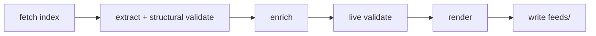

# Developer docs

Maintainer reference for **paul-graham-essay-feeds**.  
User-facing install/use: [README.md](./README.md).  
Colab: [notebook.ipynb](./notebook.ipynb).

---

## Overview

CLI that **live-fetches** the official essays index, extracts items (with
structural validation), optionally enriches short summaries from each essay
page, optionally live-probes links, and writes RSS / Atom / JSON Feed artifacts
under a repo root.



- Structural validate runs **inside** extract (always).
- Live link probes run **after** enrich when `--validate-links` / `VALIDATE_LINKS` is on.
- Default path: enrich on, live probes off. CI/offline smoke uses `--no-enrich`.

---

## Architecture

### Package layout (8 domain modules)

| Module | Responsibility |
| --- | --- |
| `model.py` | `Essay`, constants, URL/id helpers, Atom sentinel |
| `settings.py` | `Settings` via pydantic-settings (`PG_ESSAY_FEEDS_*`) |
| `fetch.py` | httpx + `hop_safe_request` / `hop_safe_get` + Tenacity |
| `validate.py` | structural checks (via extract) + optional live probes |
| `extract.py` | index HTML → ordered `Essay` list → structural validate |
| `enrich.py` | per-page scrape → short summary; month+year → `published_hint` only |
| `feeds.py` | render RSS/Atom/JSON + atomic write + `verify_feed_artifacts` |
| `cli.py` | Typer app + loguru/Rich logging; `check` → `verify_feed_artifacts` |

Entry points: `cli:main` / `__main__.py`.

### Import DAG (acyclic)

```text
model ← settings
model ← fetch
model ← validate ← fetch.hop_safe_* / run_with_retry
model ← extract ← validate (structural)
model ← enrich ← fetch.hop_safe_get / run_with_retry
model ← feeds
cli ← settings, fetch, extract, enrich, validate, feeds
```

---

## CLI reference

```bash
pg-essay-feeds update [OPTIONS]
pg-essay-feeds check  [OPTIONS]
```

### Precedence

```text
COMMANDLINE > pydantic-settings env / .env > field defaults
```

Flags override Settings **only when explicitly passed** (`ParameterSource.COMMANDLINE`).
Bool defaults on Typer options must not clobber env (e.g. `PG_ESSAY_FEEDS_ENRICH=false`
survives unless `--enrich` / `--no-enrich` is on the command line). Dual bools use
`--enrich/--no-enrich` and `--validate-links/--no-validate-links` with
`bool | None = None`. If both quiet and verbose end up true, quiet wins.

### `update`

| Flag | Default | Meaning |
| --- | --- | --- |
| `--repo-root PATH` | cwd / env | Output root for `feeds/` + `data/` |
| `--source-file PATH` | — | Local HTML instead of network fetch |
| `--min-items INT` | `233` | Fail if fewer items |
| `--timeout FLOAT` | `30` | HTTP timeout (seconds) |
| `--retries INT` | `3` | Extra attempts after first |
| `--enrich` / `--no-enrich` | enrich on (env) | Per-page short summary scrape |
| `--validate-links` / `--no-validate-links` | off (env) | Live HEAD/GET each essay URL |
| `-q` / `--quiet` | off (env) | Errors only |
| `-v` / `--verbose` | off (env) | Debug logs |

### `check`

Runs `verify_feed_artifacts` on `feeds/` (item-count parity, JSON
`content_text` == `summary`, and `feeds/.manifest.json` hash/byte checks).

| Flag | Default | Meaning |
| --- | --- | --- |
| `--repo-root PATH` | cwd / env | Root containing `feeds/` |
| `--min-items INT` | `233` | Floor for item count |
| `-q` / `--quiet` | off (env) | Errors only |
| `-v` / `--verbose` | off (env) | Debug logs |

---

## Configuration

`Settings` loads env vars with prefix **`PG_ESSAY_FEEDS_`** (optional `.env`).

| Env var | Default | Notes |
| --- | --- | --- |
| `PG_ESSAY_FEEDS_SOURCE_URL` | official articles.html | Index URL |
| `PG_ESSAY_FEEDS_REPO_ROOT` | cwd | Resolved absolute path |
| `PG_ESSAY_FEEDS_MIN_ITEMS` | `233` | Safety floor |
| `PG_ESSAY_FEEDS_TIMEOUT` | `30` | Index fetch timeout |
| `PG_ESSAY_FEEDS_RETRIES` | `3` | Tenacity attempts = retries+1 |
| `PG_ESSAY_FEEDS_MAX_BYTES` | 5 MiB | Response size cap |
| `PG_ESSAY_FEEDS_VALIDATE_LINKS` | `false` | Live probes |
| `PG_ESSAY_FEEDS_LINK_TIMEOUT` | `10` | Per-probe timeout |
| `PG_ESSAY_FEEDS_LINK_WORKERS` | `8` | Live-probe thread pool (not enrich) |
| `PG_ESSAY_FEEDS_ENRICH` | `true` | Per-page short summary scrape |
| `PG_ESSAY_FEEDS_ENRICH_WORKERS` | `12` | Enrich thread pool |
| `PG_ESSAY_FEEDS_ENRICH_TIMEOUT` | `15` | Per-page timeout |
| `PG_ESSAY_FEEDS_FORCE` | `false` | Bypass hash-based skip when index unchanged |
| `PG_ESSAY_FEEDS_QUIET` / `PG_ESSAY_FEEDS_VERBOSE` | false | Log levels |

```bash
export PG_ESSAY_FEEDS_MIN_ITEMS=233
export PG_ESSAY_FEEDS_ENRICH=false   # optional: skip per-page scrapes
```

### Latency & cost

| Mode | Network | Notes |
| --- | --- | --- |
| Default (`ENRICH=true`) | ~1 HTTP GET per essay (~233 pages today) + index GET | Richest short descriptions; uses `ENRICH_WORKERS` (default 12) |
| `--no-enrich` / `PG_ESSAY_FEEDS_ENRICH=false` | Index only | Fast; generic blurbs when no summary |
| Unchanged index | Index GET (or local read) only | SHA-256 of index HTML matches catalog `index_hash` and item fingerprint → skip enrich/write |
| `--force` / `PG_ESSAY_FEEDS_FORCE=true` | Full pipeline | Bypass hash skip |
| `--validate-links` | Additional HEAD/GET per essay | Slowest; off by default |

CI and offline smoke use `--no-enrich`. Live probes stay opt-in.

### Change detection (hashes)

- **Index:** `index_hash` = SHA-256 of source index HTML; stored on `EssayCatalog`.
- **Pages:** `content_hash` = SHA-256 of each essay page HTML after enrich; reused to skip re-parse when the page body is unchanged.
- Catalog path: `data/essays.json` (gitignored runtime artifact).

---

## Feeds contract

### Item fields (all formats)

| Field | Required | Source |
| --- | --- | --- |
| title | yes | index |
| link / url | yes | https, allowlisted host |
| guid / id | yes | URL or Turbify path UUID |
| description / summary | yes | `feed_summary()` (enrich or generic blurb, ≤~400 chars) |
| JSON `content_text` | yes | same short `feed_summary()` (not full essay body) |
| pubDate / published / date_published | no | only if page shows a month+year |

### Atom timestamps

| Element | Value |
| --- | --- |
| Feed `<updated>` | `built_at` (channel freshness) |
| Entry `<updated>` | `published_at` if set, else stable sentinel `1970-01-01T00:00:00Z` |
| Entry `<published>` | only when `published_at` is set |

Undated entry `<updated>` must **not** churn on regenerate (never falls back to `built_at`).

### Feed identity (Atom / catalog)

The Atom feed `<id>` is the constant `FEED_ID` in `model.py`
(`tag:wyattowalsh.github.io,2026:paul-graham-essay-feeds`). That tag string is a
**permanent feed identity** for readers, not a claim that a site is hosted on
github.io. Do not change it casually — swapping Atom ids breaks reader state.

### Non-goals

- Full essay bodies (`content:encoded`, Atom `<content>`, long JSON bodies)
- OPML
- Hosted CDN/site / public `feed_url`
- Invented publication dates when the page has none

> [!NOTE]
> JSON Feed items **do** include short `content_text` (= `summary` = `feed_summary()`).
> That is metadata-only, not the full essay.

### HTTP safety

Shared `hop_safe_get` / `hop_safe_request`: `follow_redirects=False`, every hop host
must be in the caller allowlist. When `max_bytes` is set, size is enforced via
`Content-Length` (when present) and a streaming hard-stop, plus a final length
check. Clients use `trust_env=False`. Local `--source-file` uses the same byte cap.

| Traffic | `allowed_hosts` |
| --- | --- |
| Index fetch | `{paulgraham.com}` |
| Enrich + live probes | `ALLOWED_HOSTS` (`paulgraham.com`, `sep.turbifycdn.com`) |

Turbify query strings are stripped for stable identity.

---

## Testing

| Layer | Path | Network |
| --- | --- | --- |
| unit | `tests/unit/` | no |
| integration | `tests/integration/` | local HTTP only |
| e2e | `tests/e2e/` | no (CLI + fixtures) |
| smoke | `tests/smoke/` | no |
| live | `tests/live/` | **yes** (opt-in) |

```bash
just test          # default: not live, cov ≥ 90%
just test-unit
just test-integration
just test-e2e
just test-smoke
just test-live     # hits paulgraham.com
just cov
```

`notebook.ipynb` is excluded from ruff (`extend-exclude`).

---

## CI & local quality gates

### GitHub Actions

- `ci.yml` — lint, types, tests, committed-feed `check`, offline smoke; job
  `timeout-minutes`; PR concurrency with `cancel-in-progress`
- `update-feeds.yml` — scheduled live refresh PR (if enabled)
- Dependabot — weekly `uv` + `github-actions` (`.github/dependabot.yml`)

### just recipes

| Recipe | Action |
| --- | --- |
| `sync` | `uv sync --all-groups` |
| `lint` | ruff format check + ruff check |
| `type` | `ty check` |
| `test` | pytest + coverage |
| `check` | `pg-essay-feeds check` |
| `smoke` | temp-root synthetic update + check |
| `update` | live `pg-essay-feeds update` |
| `all` | lint + type + test + check |

---

## Notebook

[`notebook.ipynb`](./notebook.ipynb) is a **Colab-first** runner:

1. Form options: `ROOT`, `ENRICH`, `VALIDATE_LINKS`  
2. `!pip install -q uv loguru`  
3. `!uvx --from git+… pg-essay-feeds update` (live generate)  
4. `check` + zip download  

It does **not** clone the repo to copy `feeds/`; it installs the CLI ephemerally and writes under the form `ROOT` (default `/content/pg-feeds`).

---

## Release / maintenance

1. `just all` green on a clean tree  
2. Optional: `just update` to refresh committed `feeds/`  
3. `pg-essay-feeds check`  
4. Commit when ready (user-gated)  

Quality order: **format → lint → types → tests → check**.

---

## Troubleshooting

| Symptom | Likely cause | Fix |
| --- | --- | --- |
| `Only N essays (need ≥ 233)` | index HTML incomplete / markers changed | Inspect source; temporary `--min-items` only after review |
| Enrich warnings / thin descriptions | page fetch failed or sparse HTML | Retry; or `--no-enrich` for index-only |
| Env enrich/validate ignored | flag always passed historically | Pass flags only when overriding; check `PG_ESSAY_FEEDS_*` |
| Turbify-looking double URL | relative join bug | Should be impossible post-canonicalize; open an issue with HTML snippet |
| `check` missing files | never ran `update` in that root | `update --repo-root …` first |
| Colab zip missing | generate cell not run | Run all cells in order |
| Ruff wants to touch notebook | excluded by design | `extend-exclude = ["notebook.ipynb"]` |

---

## Related files

| Path | Role |
| --- | --- |
| [README.md](./README.md) | Users |
| [DOCS.md](./DOCS.md) | Developers (this file) |
| [AGENTS.md](./AGENTS.md) | Coding agents |
| [notebook.ipynb](./notebook.ipynb) | Colab/Jupyter |
| [LICENSE](./LICENSE) | MIT |
